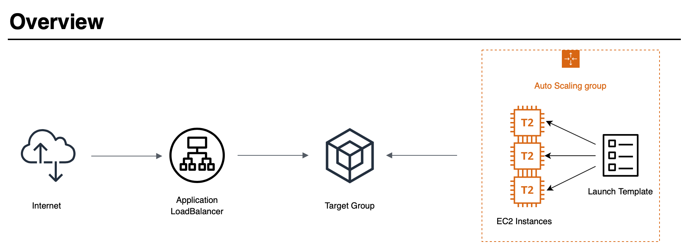
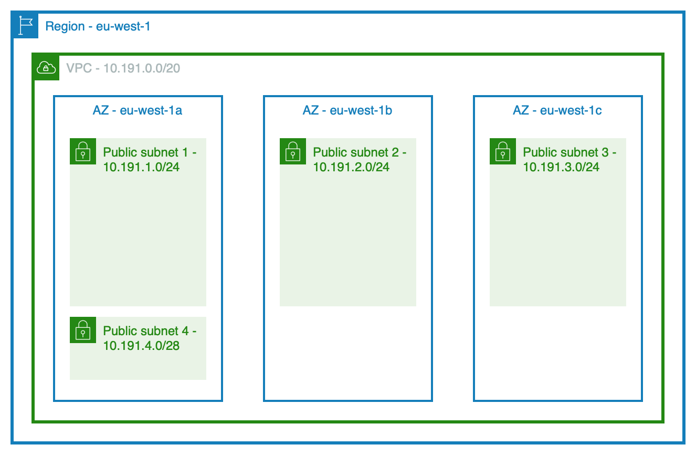

# Delkurs 2 inlämningsuppgift 1

Uppgiften är att skapa en robust, säker och skalbar hosting-miljö för en webbapplikation.

Jag kommer att använda mig av CloudFormation för att skapa upp miljön där vår webbapplikation skall vara tillgänglig från Internet. När det gäller designen så vill jag skapa ett eget VPC med tillhörande subnet i 3 stycken Availibilty Zones. En Nginx webbserver kommer att distribueras inom varje subnet via en AutoScalingGroup som använder en LaunchTemplate för att sätta upp varje webbserver på ett korrekt sätt. 



När jag beskriver den Cloudformation Template jag använder för ändamålet att skapa en robust, säker och skalbar miljö för en webbapplikation kommer jag att dela upp den i mindre delar för att i slutet på dokumentet presentera hela template:n. Template:n har fått namnet `c2a1-template.yaml. *c2a1* är en förkortning av *Course 2 Assignment 1*.

Förutsättningar:

- En lokal aws client.
- AWS konto med tillbörliga rättigheter.
- AWS Region är bestämd till eu-west-1.
- Instansernas operativsystemet är bestämt till Amazon Linux 2.

## CloudFormation Template

Template:n inleds med 3 rader.

```yaml
---
AWSTemplateFormatVersion: "2010-09-09"
Description: "Course 2, Assignment 1 - c2a1"
```

1:a raden berättar att det är en yaml fil. 2:a raden bestämmer vilken format version det är på vår template och den 3:e raden är en enkel beskrivning av vår template.

### Parameters

```yaml
Parameters:
# Network
  VpcCidr:
    Description: VPC for c2a1
    Type: String
    Default: 10.191.0.0/20

  PublicSubnet1Cidr:
    Description: Public Subnet 1 for c2a1
    Type: String
    Default: 10.191.1.0/24
  PublicSubnet2Cidr:
    Description: Public Subnet 2 for c2a1
    Type: String
    Default: 10.191.2.0/24
  PublicSubnet3Cidr:
    Description: Public Subnet 3 for c2a1
    Type: String
    Default: 10.191.3.0/24
  PublicSubnet4Cidr:
    Description: Public Subnet 4 for c2a1 Bastion Server
    Type: String
    Default: 10.191.4.0/28

# Instance
  InstanceType:
    Description: Enter t2.micro, t2.nano or t3.micro. Default is t2.micro.
    Type: String
    Default: t2.micro
    AllowedValues:
      - t2.micro
      - t2.nano
      - t3.micro

# Private ssh key
  KeyName:
    Description: Name of an existing EC2 KeyPair to enable SSH access to the web server
    Type: AWS::EC2::KeyPair::KeyName
    Default: martins-aws-campusmolndal
    ConstraintDescription: must be the name of an existing EC2 KeyPair.

# SSH Restriction
  SSHLocation:
    Description: The IP address range that are allowed to SSH to the EC2 instances
    Type: String
    MinLength: '9'
    MaxLength: '18'
    Default: 0.0.0.0/0
    AllowedPattern: (\d{1,3})\.(\d{1,3})\.(\d{1,3})\.(\d{1,3})/(\d{1,2})
    ConstraintDescription: must be a valid IP CIDR range of the form x.x.x.x/x.
```

Jag har skapat ett antal parametrar som är påverkbara via en parameters fil om vi använder oss av `aws cli`. Används *AWS Console* så är parametrarna antigen förifyllda fält som går att redigera eller vallistor.

Här följer ett exempel på en parameters fil, `c2a1-parameters.json` som refererar till de parametrar som är satta i vår CloudFormation Template:

```json
[
  {
    "ParameterKey": "InstanceType",
    "ParameterValue": "t2.micro"
  },
  {
    "ParameterKey": "KeyName",
    "ParameterValue": "martins-aws-campusmolndal"
  },
  {
    "ParameterKey": "SSHLocation",
    "ParameterValue": "81.230.68.218/32"
  }
]
```

### Mappings

```yaml
Mappings:
  RegionMap:
    eu-west-1:
      AMIAmazon: ami-0bb3fad3c0286ebd5
    eu-north-1:
      AMIAmazon: ami-0653812935d0743fe
```

I mappings sektionen skapar jag möjligheten att använda vår CloudFormation Template i olika regioner. För tillfället är det bara ami:er för Amazon Linux 2 64-bit x86 som stödjs i templaten:n.

### Launch Template

```yaml
  LaunchTemplate:
    Type: AWS::EC2::LaunchTemplate
    DependsOn:
      - InstanceSecurityGroup
      - WebSecurityGroup
    Properties:
      LaunchTemplateData:
        InstanceType: !Ref InstanceType
        ImageId: !FindInMap [ RegionMap, !Ref "AWS::Region", AMIAmazon ]
        KeyName: !Ref KeyName
        SecurityGroupIds:
          - !GetAtt InstanceSecurityGroup.GroupId
          - !GetAtt WebSecurityGroup.GroupId
        TagSpecifications:
        - ResourceType: instance
          Tags:
          - Key: Name
            Value: c2a1
          - Key: Env
            Value: dev
        UserData: IyEvYmluL2Jhc2gKIyBVc ...
      LaunchTemplateName: c2a1-template
```

I vår Launch Template finns några attribut och properties som är mer intressanta än andra, här följer en kort förklaring av dessa.

###### DependsOn

```yaml
DependsOn:
      - InstanceSecurityGroup
      - WebSecurityGroup
```

Vår Launch Template är beroende av att de säkerhetsgrupper som kopplas till den slutgiltiga instansen är skapade innan Launch Template:n för att vi skall kunna få ut säkerhetsgruppernas grupp id för användning i `Properties: SecurityGroupIds`.

###### SecurityGroupIds

```yaml
        SecurityGroupIds:
          - !GetAtt InstanceSecurityGroup.GroupId
          - !GetAtt WebSecurityGroup.GroupId
```

Säkerhetsgrupperna kommer att beskrivas mer senare i detta dokument.

###### InstanceType

```yaml
    InstanceType: !Ref InstanceType
```

InstanceType refererar tillbaka till den tidigare satta parametern InstanceType som jag satt till `t2.micro` som standard.

###### ImageId

```yaml
    ImageId: !FindInMap [ RegionMap, !Ref "AWS::Region", AMIAmazon ]
```

ImageId får värdet av den ami som är mappad till den region som vi befinner oss i. I denna uppgift bestämmer förutsättningarna att vi skall befinna oss i eu-west-1 men det går alltså att använda CloudFormation template:n i en annan region om så behövs. 

###### KeyName

```yaml
    KeyName: !Ref KeyName
```

KeyName refererar till parametern KeyName som inte har ett standard värde utan här måste ett val genomföras eller att en personliga nyckel specas i `c2a1-parameters.json`.

###### UserData

Eftersom UserData är base64 kodad så har jag i detta dokument bara tagit med de första tecknen under rubriken Launch Template. Här följer nu UserData men i en mer läsbar form.

```bash
#!/bin/bash
# Update and Install
yum update -y
amazon-linux-extras install nginx1 -y
yum clean all
# Create admin user
useradd admin
usermod -aG wheel admin
# Update sudoers
cat << EOF > /etc/sudoers.d/91-admin-user
# User rules for admin user in sudoers
admin ALL=(ALL) NOPASSWD:ALL
EOF
# Add public ssh key
mkdir /home/admin/.ssh
chown admin:admin /home/admin/.ssh
chmod 0700 /home/admin/.ssh
echo "ssh-rsa AAAAB3NzaC1yc2EAAAABIwAAAQEAvdlI4 ..." >> /home/admin/.ssh/authorized_keys
chown admin /home/admin/.ssh/authorized_keys
chmod 0600 /home/admin/.ssh/authorized_keys
# Create a new default homepage containing my name
# and the private ip address of the web server instance.
ipaddress=$(hostname -s | cut -d"-" -f2,3,4,5 | tr - .)
cat << EOF > /usr/share/nginx/html/index.html
<!DOCTYPE html>
<html lang="en">
<head>
  <meta charset="UTF-8">
  <title>Course 2, Assignment 1</title>
</head>
<body>
  <h1>Martin Hellström</h1>
<p>Private IP Address: $ipaddress</p>
</body>
</html>
EOF
# Enable and start services
systemctl enable nginx
systemctl start nginx
```

Till att börja med så uppdaterar jag OS:et och ser även till att installera Nginx. 

Efter det skapar jag en admin användare mest för att visa ett av flera sätt att lägga till en egen användare redan vid skapandet av en instans. Jag lägger även till en public ssh nyckel för användaren admin, som skiljer sig ifrån den som är skapad och lagrad i AWS.

Nästa steg är att skapa en ny `index.html` som innehåller mitt namn och instansens privata ipadress.

Sista steget är att aktivera och starta nginx tjänsten.

### Network overview



Bilden visar en enkel översikt över hur de olika subnäten är placerade i olika Availability Zones (AZ) inom vår region och vårt VPC. Även nätverksadresserna som specades i Parameter sektion syns på bilden. Inom våra publika subnät 1 - 3 kommer webbservrarna att placeras och i det 4:e subnätet kommer en bastion server placeras som vi kommer att kunna köra `ssh` till, ifrån den ipadress som sätts med parametern SSHLocation, som standard är det hela internet.

#### VPC

Vi skapar upp ett helt nytt VPC för vår miljö.

```yaml
  VPC:
    Type: AWS::EC2::VPC
    Properties:
      CidrBlock: !Ref VpcCidr
      EnableDnsSupport: true
      EnableDnsHostnames: true
      Tags:
        - Key: Name
          Value: c2a1 Vpc
        - Key: Env
          Value: dev
```

#### Subnets

Vi skapar upp 4 stycken subnät och placerar ut dom enligt översiktsbilden i olika Availability Zones.

```yaml
  PublicSubnet1:
    Type: AWS::EC2::Subnet
    DependsOn: VPC
    Properties:
      VpcId: !Ref VPC
      MapPublicIpOnLaunch: true
      CidrBlock: !Ref PublicSubnet1Cidr
      AvailabilityZone: !Select
        - 0
        - !GetAZs
          Ref: AWS::Region
      Tags:
        - Key: Name
          Value: c2a1 Public Subnet AZ1
        - Key: Env
          Value: dev

  PublicSubnet2:
    Type: AWS::EC2::Subnet
    DependsOn: VPC
    Properties:
      VpcId: !Ref VPC
      MapPublicIpOnLaunch: true
      CidrBlock: !Ref PublicSubnet2Cidr
      AvailabilityZone: !Select
        - 1
        - !GetAZs
          Ref: AWS::Region
      Tags:
        - Key: Name
          Value: c2a1 Public Subnet AZ2
        - Key: Env
          Value: dev

  PublicSubnet3:
    Type: AWS::EC2::Subnet
    DependsOn: VPC
    Properties:
      VpcId: !Ref VPC
      MapPublicIpOnLaunch: true
      CidrBlock: !Ref PublicSubnet3Cidr
      AvailabilityZone: !Select
        - 2
        - !GetAZs
          Ref: AWS::Region
      Tags:
        - Key: Name
          Value: c2a1 Public Subnet AZ3
        - Key: Env
          Value: dev

  PublicSubnet4:
    Type: AWS::EC2::Subnet
    DependsOn: VPC
    Properties:
      VpcId: !Ref VPC
      MapPublicIpOnLaunch: true
      CidrBlock: !Ref PublicSubnet4Cidr
      AvailabilityZone: !Select
        - 0
        - !GetAZs
          Ref: AWS::Region
      Tags:
        - Key: Name
          Value: c2a1 Public Subnet AZ1
        - Key: Env
          Value: dev
```

#### Routing

För att nätverkstrafiken skall hitta rätt behöver vi sätta upp en routingtabell per subnät och koppla dom till en Route. Default routen kopplas sedan även ihop med vår Internet Gateway.

```yaml
  PublicRouteTable:
    Type: AWS::EC2::RouteTable
    DependsOn: VPC
    Properties:
      VpcId: !Ref VPC
      Tags:
        - Key: Name
          Value: c2a1 Public Route Table
        - Key: Env
          Value: dev

  DefaultPublicRoute:
    Type: AWS::EC2::Route
    DependsOn:
      - PublicRouteTable
      - InternetGatewayAttachment
    Properties:
      DestinationCidrBlock: 0.0.0.0/0
      GatewayId: !Ref InternetGateway
      RouteTableId: !Ref PublicRouteTable

  PublicSubnet1RouteTableAssociation:
    Type: AWS::EC2::SubnetRouteTableAssociation
    DependsOn:
      - PublicRouteTable
      - PublicSubnet1
    Properties:
      RouteTableId: !Ref PublicRouteTable
      SubnetId: !Ref PublicSubnet1

  PublicSubnet2RouteTableAssociation:
    Type: AWS::EC2::SubnetRouteTableAssociation
    DependsOn:
      - PublicRouteTable
      - PublicSubnet2
    Properties:
      RouteTableId: !Ref PublicRouteTable
      SubnetId: !Ref PublicSubnet2

  PublicSubnet3RouteTableAssociation:
    Type: AWS::EC2::SubnetRouteTableAssociation
    DependsOn:
      - PublicRouteTable
      - PublicSubnet3
    Properties:
      RouteTableId: !Ref PublicRouteTable
      SubnetId: !Ref PublicSubnet3

  PublicSubnet4RouteTableAssociation:
    Type: AWS::EC2::SubnetRouteTableAssociation
    DependsOn:
      - PublicRouteTable
      - PublicSubnet4
    Properties:
      RouteTableId: !Ref PublicRouteTable
      SubnetId: !Ref PublicSubnet4
```

#### Internet Gateway

En internet gateway måste skapas och logiskt kopplas till vårt VPC för att nätverkstrafiken skall kunna hitta in och ut från våra nät.

```yaml
  InternetGateway:
    Type: AWS::EC2::InternetGateway
    Properties:
      Tags:
        - Key: Name
          Value: c2a1 Internet Gateway
        - Key: Env
          Value: dev

  InternetGatewayAttachment:
    Type: AWS::EC2::VPCGatewayAttachment
    DependsOn:
      - InternetGateway
      - VPC
    Properties:
      InternetGatewayId: !Ref InternetGateway
      VpcId: !Ref VPC
```

### Security group overview

Template:n skapar upp fyra stycken Security Groups. Två stycken är knutna till webb instanserna, en är kopplad till vår Bastion instans och den sista är kopplad till lastbalanseraren.

###### SshSecurityGroup

Denna Security Group används för att styra vilken nätverkstrafik som släpps fram till vår Bastion server.

```yaml
  SshSecurityGroup:
    Type: 'AWS::EC2::SecurityGroup'
    Properties:
      GroupName: SshSG-c2a1
      GroupDescription: Enable SSH access via port 22
      VpcId: !Ref VPC
      SecurityGroupIngress:
        - IpProtocol: tcp
          FromPort: '22'
          ToPort: '22'
          CidrIp: !Ref SSHLocation
      Tags:
        - Key: Name
          Value: c2a1 Ssh Security Group
        - Key: Env
          Value: dev
```

`CidrIp: !Ref SSHLocation` refererar till parametern SSHLocation vilken som standard är satt till alla adresser men som med fördel kan strypas ner till en eller ett fåtal adresser beroende på lokal nätverksuppsättning.

###### WebSecurityGroup

Denna Security Group hanterar nätverkstrafiken till våra webbservrar på tcp-port 80. Både Ingress trafik och Egress trafik är kontrollerad både för kontroll och referens.  Inkommande nätverkstrafik tillåts bara ifrån Lastbalanseraren eftersom den trafiken kontrolleras av Security Group *LoadBalancerSecurityGroup*.

```yaml
    WebSecurityGroup:
    Type: 'AWS::EC2::SecurityGroup'
    DependsOn:
      - VPC
      - LoadBalancerSecurityGroup
    Properties:
      GroupName: WebSG-c2a1
      GroupDescription: Enable Web access via port 80
      VpcId: !Ref VPC
      SecurityGroupEgress:
        - IpProtocol: tcp
          FromPort: '80'
          ToPort: '80'
          CidrIp: 0.0.0.0/0
        - IpProtocol: tcp
          FromPort: '443'
          ToPort: '443'
          CidrIp: 0.0.0.0/0
      Tags:
        - Key: Name
          Value: c2a1 Web Security Group
        - Key: Env
          Value: dev
  InboundRule:
    Type: 'AWS::EC2::SecurityGroupIngress'
    Properties:
      GroupId: !GetAtt WebSecurityGroup.GroupId
      IpProtocol: tcp
      FromPort: '80'
      ToPort: '80'
      SourceSecurityGroupId: !GetAtt LoadBalancerSecurityGroup.GroupId
```

Utgående nätverkstrafik styrs av property:n `SecurityGroupEgress` och endast http/https trafik är tillåten ut från webbservrarna till alla nätverksadresser.

För att kunna koppla en Security Group till en annan Security Group krävs att `Type: 'AWS::EC2::SecurityGroupIngress'` används som med properties `GroupId` och `SourceSecurityGroupId` logiskt genomför kopplingen.

###### InstanceSecurityGroup

Denna Security Group tillåter bara ssh trafik från nätet PublicSubnet4, där vår Bastion server är placerad, till våra webbserver instanser även om dom är placerade på publika nät. Här hade det fungerat att styra trafiken som i *WebSecurityGroup* med länkade säkerhetsgrupper men detta är ett exempel på en mer klassisk nätverkssegmentering.

```yaml
  InstanceSecurityGroup:
    Type: 'AWS::EC2::SecurityGroup'
    DependsOn: VPC
    Properties:
      GroupName: InstanceSG-c2a1
      GroupDescription: Enable ssh access via port 22 from Public Subnet 4
      VpcId: !Ref VPC
      SecurityGroupIngress:
        - IpProtocol: tcp
          FromPort: '22'
          ToPort: '22'
          CidrIp: !Ref PublicSubnet4Cidr
      Tags:
        - Key: Name
          Value: c2a1 Instance Security Group
        - Key: Env
          Value: dev
```

###### LoadBalancerSecurityGroup

Denna säkerhetsgrupp kontrollerar trafiken till lastbalanseraren.

```yaml
  LoadBalancerSecurityGroup:
    Type: 'AWS::EC2::SecurityGroup'
    DependsOn: VPC
    Properties:
      GroupName: LoadBalancerSG-c2a1
      GroupDescription: Enable http access via port 80 from Internet
      VpcId: !Ref VPC
      SecurityGroupIngress:
        - IpProtocol: tcp
          FromPort: '80'
          ToPort: '80'
          CidrIp: 0.0.0.0/0
      Tags:
        - Key: Name
          Value: c2a1 Load Balancer Security Group
        - Key: Env
          Value: dev
```

### Auto Scaling Group

Auto Scaling gruppen sträcker sig över alla 3 Availability Zones och hät bestäms även hur många instanser som är *DesiredCapacity* samt Max och MinSize. Launch Template:n pekas ut och vilken version av templaten som skall användas. I detta fall så blir det version 1 som är den senaste version. En Target grupp pekas ut där våra instanser kommer att registreras med automatik när dom blir tillgängliga.

```yaml
  c2a1ASG:
    Type: AWS::AutoScaling::AutoScalingGroup
    Properties:
      AutoScalingGroupName: c2a1-ASG
      AvailabilityZones:
        - "eu-west-1a"
        - "eu-west-1b"
        - "eu-west-1c"
      MinSize: '0'
      MaxSize: '6'
      DesiredCapacity: '3'
      LaunchTemplate:
        LaunchTemplateId: !Ref LaunchTemplate
        Version: !GetAtt LaunchTemplate.LatestVersionNumber
      TargetGroupARNs:
        - !Ref TargetGroup
      VPCZoneIdentifier:
        - !Ref PublicSubnet1
        - !Ref PublicSubnet2
        - !Ref PublicSubnet3
      Tags:
        - Key: Name
          Value: c2a1 Auto Scaling Group
          PropagateAtLaunch: 'false'
        - Key: Env
          Value: dev
          PropagateAtLaunch: 'true'
```

### Target Group

Target gruppen skapas och kopplas till vårt VPC.

```yaml
  TargetGroup:
    Type: AWS::ElasticLoadBalancingV2::TargetGroup
    Properties:
      Name: c2a1TargetGroup
      VpcId: !Ref VPC
      Port: '80'
      Protocol: HTTP
      Tags:
        - Key: Name
          Value: c2a1 Target Group
        - Key: Env
          Value: dev
```

### LoadBalancer

Lastbalanserare kan lastdela trafik till subnet 1-3 och lyssnaren kommer att skicka trafiken vidare till de EC2 instanser som finns registrerade i vår Target Group.

```yaml
  c2a1LoadBalancer:
    Type: AWS::ElasticLoadBalancingV2::LoadBalancer
    DependsOn: VPC
    Properties:
      Name: c2a1-lb
      Subnets:
        - !Ref PublicSubnet1
        - !Ref PublicSubnet2
        - !Ref PublicSubnet3
      SecurityGroups:
        - !Ref LoadBalancerSecurityGroup
      Tags:
        - Key: Name
          Value: c2a1 Load Balancer
        - Key: Env
          Value: dev

  LoadBalancerListener:
    Type: AWS::ElasticLoadBalancingV2::Listener
    Properties:
      LoadBalancerArn: !Ref c2a1LoadBalancer
      Port: 80
      Protocol: HTTP
      DefaultActions:
        - Type: forward
          TargetGroupArn: !Ref TargetGroup
```

### Bastion instance

Bastion instansen skapas upp och placeras på vårt publika subnät nummer 4.

```yaml
  BastionInstance:
    Type: AWS::EC2::Instance
    Properties:
      ImageId: !FindInMap [ RegionMap, !Ref "AWS::Region", AMIAmazon ]
      InstanceType: !Ref 'InstanceType'
      KeyName: !Ref 'KeyName'
      SecurityGroupIds:
        - !Ref 'SshSecurityGroup'
      SubnetId: !Ref 'PublicSubnet4'
      UserData:
        "Fn::Base64": !Sub |
          #!/bin/bash -xe
          yum update -y
          yum clean all
          useradd admin
          usermod -aG wheel admin
          # Update sudoers
          cat << EOF > /etc/sudoers.d/91-admin-user
          # User rules for admin user
          admin ALL=(ALL) NOPASSWD:ALL
          EOF
          # Add ssh keys
          mkdir /home/admin/.ssh
          chown admin:admin /home/admin/.ssh
          chmod 0700 /home/admin/.ssh
          echo "ssh-rsa AAAAB3NzaC1yc2EAAAABIwAAAQEAvdlI4/FKOrm6e8zWvFIuBGzqi31et8ExDnrO6L6w5O1JI4S0n5kxcNlTkm0+0I/pa/PWdsg21/IsDPE9DWO+9bEX18zPF8BSBWK2bUkSy9KXeaT2QYW0YTlBvkDW7+tBOlBAXqIp25867XsjR0SBepewDlaHEwhUl+A+TBs+Mdy+WVHR4uyg79yKoKCU5srV/tXGaeUs8W8QfLgjAMCAJpsGQ4b32fZmo8xEnU+q7OsMin32sG7wM6M2kcVF2m4ZEDaPwdCon1VVtU/5bQfxE17aKE5HdSQtJ+iF2ImPSfaFUT72EZvEymJlGuthaBjTyOKmlXtDsQuBh8HfHFxhhQ== martin@macbook-2.local" >> /home/admin/.ssh/authorized_keys
          chown admin /home/admin/.ssh/authorized_keys
          chmod 0600 /home/admin/.ssh/authorized_keys
      Tags:
        - Key: Name
          Value: c2a1 Bastion Server
        - Key: Env
          Value: dev
```

### Outputs

I Outputs sektionen plockar vi fram den URL som vi behöver för att kunna testa att webbapplikationen fungerar som tänkt och den publika ipadressen till vår Bastion instans.

```yaml
Outputs:
  LoadBalancerUrl:
    Description: The URL of the ALB
    Value: !GetAtt c2a1LoadBalancer.DNSName

  BastionIp:
    Description: The Ip address of the Bastion Instance.
    Value: !GetAtt BastionInstance.PublicIp
```

## Cli commands

Nu är det dax att deploy:a vår CloudFormation Template och skapa en *CloudFormation stack*.

Skapa en stack:

```bash
aws cloudformation create-stack --stack-name c2a1-stack \
--template-body file://c2a1-template.yaml \
--parameters file://c2a1-parameters.json
```

Visa output:

```bash
aws cloudformation describe-stacks --stack-name c2a1-stack \
--query "Stacks[*].Outputs" --output json
```

Förändra antalet instanser i vår Auto Scaling Group.

```bash
aws autoscaling set-desired-capacity --auto-scaling-group-name c2a1-ASG \
--desired-capacity 2
```

Testa att logga på vår bastion instans och hoppa vidare till en av våra webbserver instanser.

```bash
eval $(ssh-agent)
ssh-add ~/.ssh/id_rsa
ssh -A -l admin <bastion public ip>
bastion: ~admin$ ssh 10.191.1.195
```

eller använd din lokala ssh config fil med direktivet *ProxyJump*. 

Exempel:

```bash
Host bastion
  Hostname 13.53.182.39
  IdentityFile ~/.ssh/martins-aws-campusmolndal.pem
  User ec2-user

Host c2a1-web-az1
  Hostname 10.191.1.195
  IdentityFile ~/.ssh/martins-aws-campusmolndal.pem
  User ec2-user
  ProxyJump bastion

Host c2a1-web-az2
  Hostname 10.191.2.131
  IdentityFile ~/.ssh/martins-aws-campusmolndal.pem
  User ec2-user
  ProxyJump bastion
```

Plocka bort hela stacken.

```bash
aws cloudformation delete-stack --stack-name c2a1-stack
```

## Förbättringar

* Möjligheten att använda andra Linux distributioner än Amazon Linux 2 t.ex CentOS. Det krävs då lite logik i user-data delen för våra instanser men är fullt genomförbart. Ett annat sätt är att lägga in så lite som möjligt i user-data och istället förlita sig på t.ex. Ansible för configuration och installation av instanserna. 

* Placera webbservrarna på privata nät så att det bara är lastbalanseraren som har en publik ipadress. Känns onödigt att boka upp publika ipadresser till våra webservrar som aldrig kommer att användas.

* Centralisera loggning med hjälp av CloudWatch.

## GitHub

På GitHub finns den CloudFormation Template som jag försökt beskriva här plus detta dokument.

<URLLLLLL>

## Appendix

#### c2a1-template.yaml

Här är hela CloudFormation Template:n i sin helhet.

```yaml
---
AWSTemplateFormatVersion: "2010-09-09"
Description: "Course 2, Assignment 1 - c2a1"
Parameters:
# Network
  VpcCidr:
    Description: VPC for c2a1
    Type: String
    Default: 10.191.0.0/20

  PublicSubnet1Cidr:
    Description: Public Subnet 1 for c2a1
    Type: String
    Default: 10.191.1.0/24
  PublicSubnet2Cidr:
    Description: Public Subnet 2 for c2a1
    Type: String
    Default: 10.191.2.0/24
  PublicSubnet3Cidr:
    Description: Public Subnet 3 for c2a1
    Type: String
    Default: 10.191.3.0/24
  PublicSubnet4Cidr:
    Description: Public Subnet 4 for c2a1 Bastion Server
    Type: String
    Default: 10.191.4.0/28

# Instance
  InstanceType:
    Description: Enter t2.micro, t2.nano or t3.micro. Default is t2.micro.
    Type: String
    Default: t2.micro
    AllowedValues:
      - t2.micro
      - t2.nano
      - t3.micro

# Private ssh key
  KeyName:
    Description: Name of an existing EC2 KeyPair to enable SSH access to the web server
    Type: AWS::EC2::KeyPair::KeyName
    ConstraintDescription: must be the name of an existing EC2 KeyPair.

# SSH Restrication
  SSHLocation:
    Description: The IP address range that can be used to SSH to the EC2 instances
    Type: String
    MinLength: '9'
    MaxLength: '18'
    Default: 0.0.0.0/0
    AllowedPattern: (\d{1,3})\.(\d{1,3})\.(\d{1,3})\.(\d{1,3})/(\d{1,2})
    ConstraintDescription: must be a valid IP CIDR range of the form x.x.x.x/x.

Mappings:
  RegionMap:
    eu-west-1:
      AMIAmazon: ami-0bb3fad3c0286ebd5
    eu-north-1:
      AMIAmazon: ami-0653812935d0743fe

Resources:
  LaunchTemplate:
    Type: AWS::EC2::LaunchTemplate
    DependsOn:
      - InstanceSecurityGroup
      - WebSecurityGroup
    Properties:
      LaunchTemplateData:
        InstanceType: !Ref InstanceType
        ImageId: !FindInMap [ RegionMap, !Ref "AWS::Region", AMIAmazon ]
        KeyName: !Ref KeyName
        SecurityGroupIds:
          - !GetAtt InstanceSecurityGroup.GroupId
          - !GetAtt WebSecurityGroup.GroupId
        TagSpecifications:
        - ResourceType: instance
          Tags:
          - Key: Name
            Value: c2a1 Web Instance
          - Key: Env
            Value: dev
        UserData: IyEvYmluL2Jhc2gKIyBVcGRhdGUgYW5kIEluc3RhbGwKeXVtIHVwZGF0ZSAteQphbWF6b24tbGludXgtZXh0cmFzIGluc3RhbGwgbmdpbngxIC15Cnl1bSBjbGVhbiBhbGwKIyBDcmVhdGUgYWRtaW4gdXNlcgp1c2VyYWRkIGFkbWluCnVzZXJtb2QgLWFHIHdoZWVsIGFkbWluCiMgVXBkYXRlIHN1ZG9lcnMKY2F0IDw8IEVPRiA+IC9ldGMvc3Vkb2Vycy5kLzkxLWFkbWluLXVzZXIKIyBVc2VyIHJ1bGVzIGZvciBhZG1pbiB1c2VyCmFkbWluIEFMTD0oQUxMKSBOT1BBU1NXRDpBTEwKRU9GCiMgQWRkIHNzaCBrZXlzCm1rZGlyIC9ob21lL2FkbWluLy5zc2gKY2hvd24gYWRtaW46YWRtaW4gL2hvbWUvYWRtaW4vLnNzaApjaG1vZCAwNzAwIC9ob21lL2FkbWluLy5zc2gKZWNobyAic3NoLXJzYSBBQUFBQjNOemFDMXljMkVBQUFBQkl3QUFBUUVBdmRsSTQvRktPcm02ZTh6V3ZGSXVCR3pxaTMxZXQ4RXhEbnJPNkw2dzVPMUpJNFMwbjVreGNObFRrbTArMEkvcGEvUFdkc2cyMS9Jc0RQRTlEV08rOWJFWDE4elBGOEJTQldLMmJVa1N5OUtYZWFUMlFZVzBZVGxCdmtEVzcrdEJPbEJBWHFJcDI1ODY3WHNqUjBTQmVwZXdEbGFIRXdoVWwrQStUQnMrTWR5K1dWSFI0dXlnNzl5S29LQ1U1c3JWL3RYR2FlVXM4VzhRZkxnakFNQ0FKcHNHUTRiMzJmWm1vOHhFblUrcTdPc01pbjMyc0c3d002TTJrY1ZGMm00WkVEYVB3ZENvbjFWVnRVLzViUWZ4RTE3YUtFNUhkU1F0SitpRjJJbVBTZmFGVVQ3MkVadkV5bUpsR3V0aGFCalR5T0ttbFh0RHNRdUJoOEhmSEZ4aGhRPT0gbWFydGluQG1hY2Jvb2stMi5sb2NhbCIgPj4gL2hvbWUvYWRtaW4vLnNzaC9hdXRob3JpemVkX2tleXMKY2hvd24gYWRtaW4gL2hvbWUvYWRtaW4vLnNzaC9hdXRob3JpemVkX2tleXMKY2htb2QgMDYwMCAvaG9tZS9hZG1pbi8uc3NoL2F1dGhvcml6ZWRfa2V5cwojIENyZWF0ZSBhIG5ldyBkZWZhdWx0IGhvbWVwYWdlLgppcGFkZHJlc3M9JChob3N0bmFtZSAtcyB8IGN1dCAtZCItIiAtZjIsMyw0LDUgfCB0ciAtIC4pCmNhdCA8PCBFT0YgPiAvdXNyL3NoYXJlL25naW54L2h0bWwvaW5kZXguaHRtbAo8IURPQ1RZUEUgaHRtbD4KPGh0bWwgbGFuZz0iZW4iPgo8aGVhZD4KICA8bWV0YSBjaGFyc2V0PSJVVEYtOCI+CiAgPHRpdGxlPkNvdXJzZSAyLCBBc3NpZ25tZW50IDE8L3RpdGxlPgo8L2hlYWQ+Cjxib2R5PgogIDxoMT5NYXJ0aW4gSGVsbHN0csO2bTwvaDE+CjxwPlByaXZhdGUgSVAgQWRkcmVzczogJGlwYWRkcmVzczwvcD4KPC9ib2R5Pgo8L2h0bWw+CkVPRgojIEVuYWJsZSBhbmQgc3RhcnQgc2VydmljZXMKc3lzdGVtY3RsIGVuYWJsZSBuZ2lueApzeXN0ZW1jdGwgc3RhcnQgbmdpbngK
      LaunchTemplateName: c2a1-template

  c2a1ASG:
    Type: AWS::AutoScaling::AutoScalingGroup
    Properties:
      AutoScalingGroupName: c2a1-ASG
      AvailabilityZones:
        - "eu-west-1a"
        - "eu-west-1b"
        - "eu-west-1c"
      MinSize: '0'
      MaxSize: '6'
      DesiredCapacity: '3'
      LaunchTemplate:
        LaunchTemplateId: !Ref LaunchTemplate
        Version: !GetAtt LaunchTemplate.LatestVersionNumber
      TargetGroupARNs:
        - !Ref TargetGroup
      VPCZoneIdentifier:
        - !Ref PublicSubnet1
        - !Ref PublicSubnet2
        - !Ref PublicSubnet3
      Tags:
        - Key: Name
          Value: c2a1 Auto Scaling Group
          PropagateAtLaunch: 'false'
        - Key: Env
          Value: dev
          PropagateAtLaunch: 'true'

  c2a1LoadBalancer:
    Type: AWS::ElasticLoadBalancingV2::LoadBalancer
    DependsOn: VPC
    Properties:
      Name: c2a1-lb
      Subnets:
        - !Ref PublicSubnet1
        - !Ref PublicSubnet2
        - !Ref PublicSubnet3
      SecurityGroups:
        - !Ref LoadBalancerSecurityGroup
      Tags:
        - Key: Name
          Value: c2a1 Load Balancer
        - Key: Env
          Value: dev

  LoadBalancerListener:
    Type: AWS::ElasticLoadBalancingV2::Listener
    Properties:
      LoadBalancerArn: !Ref c2a1LoadBalancer
      Port: 80
      Protocol: HTTP
      DefaultActions:
        - Type: forward
          TargetGroupArn: !Ref TargetGroup

  TargetGroup:
    Type: AWS::ElasticLoadBalancingV2::TargetGroup
    Properties:
      Name: c2a1TargetGroup
      VpcId: !Ref VPC
      Port: '80'
      Protocol: HTTP
      Tags:
        - Key: Name
          Value: c2a1 Target Group
        - Key: Env
          Value: dev


# Security Groups
  SshSecurityGroup:
    Type: 'AWS::EC2::SecurityGroup'
    Properties:
      GroupName: SshSG-c2a1
      GroupDescription: Enable SSH access via port 22
      VpcId: !Ref VPC
      SecurityGroupIngress:
        - IpProtocol: tcp
          FromPort: '22'
          ToPort: '22'
          CidrIp: !Ref SSHLocation
      Tags:
        - Key: Name
          Value: c2a1 Ssh Security Group
        - Key: Env
          Value: dev

  WebSecurityGroup:
    Type: 'AWS::EC2::SecurityGroup'
    DependsOn:
      - VPC
      - LoadBalancerSecurityGroup
    Properties:
      GroupName: WebSG-c2a1
      GroupDescription: Enable Web access via port 80
      VpcId: !Ref VPC
      SecurityGroupEgress:
        - IpProtocol: tcp
          FromPort: '80'
          ToPort: '80'
          CidrIp: 0.0.0.0/0
        - IpProtocol: tcp
          FromPort: '443'
          ToPort: '443'
          CidrIp: 0.0.0.0/0
      Tags:
        - Key: Name
          Value: c2a1 Web Security Group
        - Key: Env
          Value: dev
  InboundRule:
    Type: 'AWS::EC2::SecurityGroupIngress'
    Properties:
      GroupId: !GetAtt WebSecurityGroup.GroupId
      IpProtocol: tcp
      FromPort: '80'
      ToPort: '80'
      SourceSecurityGroupId: !GetAtt LoadBalancerSecurityGroup.GroupId

  InstanceSecurityGroup:
    Type: 'AWS::EC2::SecurityGroup'
    DependsOn: VPC
    Properties:
      GroupName: InstanceSG-c2a1
      GroupDescription: Enable ssh access via port 22 from Public Subnet 4
      VpcId: !Ref VPC
      SecurityGroupIngress:
        - IpProtocol: tcp
          FromPort: '22'
          ToPort: '22'
          CidrIp: !Ref PublicSubnet4Cidr
      Tags:
        - Key: Name
          Value: c2a1 Instance Security Group
        - Key: Env
          Value: dev

  LoadBalancerSecurityGroup:
    Type: 'AWS::EC2::SecurityGroup'
    DependsOn: VPC
    Properties:
      GroupName: LoadBalancerSG-c2a1
      GroupDescription: Enable http access via port 80 from Internet
      VpcId: !Ref VPC
      SecurityGroupIngress:
        - IpProtocol: tcp
          FromPort: '80'
          ToPort: '80'
          CidrIp: 0.0.0.0/0
      Tags:
        - Key: Name
          Value: c2a1 Load Balancer Security Group
        - Key: Env
          Value: dev

  BastionInstance:
    Type: AWS::EC2::Instance
    Properties:
      ImageId: !FindInMap [ RegionMap, !Ref "AWS::Region", AMIAmazon ]
      InstanceType: !Ref 'InstanceType'
      KeyName: !Ref 'KeyName'
      SecurityGroupIds:
        - !Ref 'SshSecurityGroup'
      SubnetId: !Ref 'PublicSubnet4'
      UserData:
        "Fn::Base64": !Sub |
          #!/bin/bash -xe
          yum update -y
          yum clean all
          useradd admin
          usermod -aG wheel admin
          # Update sudoers
          cat << EOF > /etc/sudoers.d/91-admin-user
          # User rules for admin user
          admin ALL=(ALL) NOPASSWD:ALL
          EOF
          # Add ssh keys
          mkdir /home/admin/.ssh
          chown admin:admin /home/admin/.ssh
          chmod 0700 /home/admin/.ssh
          echo "ssh-rsa AAAAB3NzaC1yc2EAAAABIwAAAQEAvdlI4/FKOrm6e8zWvFIuBGzqi31et8ExDnrO6L6w5O1JI4S0n5kxcNlTkm0+0I/pa/PWdsg21/IsDPE9DWO+9bEX18zPF8BSBWK2bUkSy9KXeaT2QYW0YTlBvkDW7+tBOlBAXqIp25867XsjR0SBepewDlaHEwhUl+A+TBs+Mdy+WVHR4uyg79yKoKCU5srV/tXGaeUs8W8QfLgjAMCAJpsGQ4b32fZmo8xEnU+q7OsMin32sG7wM6M2kcVF2m4ZEDaPwdCon1VVtU/5bQfxE17aKE5HdSQtJ+iF2ImPSfaFUT72EZvEymJlGuthaBjTyOKmlXtDsQuBh8HfHFxhhQ== martin@macbook-2.local" >> /home/admin/.ssh/authorized_keys
          chown admin /home/admin/.ssh/authorized_keys
          chmod 0600 /home/admin/.ssh/authorized_keys
      Tags:
        - Key: Name
          Value: c2a1 Bastion Server
        - Key: Env
          Value: dev

# Network
  VPC:
    Type: AWS::EC2::VPC
    Properties:
      CidrBlock: !Ref VpcCidr
      EnableDnsSupport: true
      EnableDnsHostnames: true
      Tags:
        - Key: Name
          Value: c2a1 Vpc
        - Key: Env
          Value: dev

  InternetGateway:
    Type: AWS::EC2::InternetGateway
    Properties:
      Tags:
        - Key: Name
          Value: c2a1 Internet Gateway
        - Key: Env
          Value: dev

  InternetGatewayAttachment:
    Type: AWS::EC2::VPCGatewayAttachment
    DependsOn:
      - InternetGateway
      - VPC
    Properties:
      InternetGatewayId: !Ref InternetGateway
      VpcId: !Ref VPC

  PublicSubnet1:
    Type: AWS::EC2::Subnet
    DependsOn: VPC
    Properties:
      VpcId: !Ref VPC
      MapPublicIpOnLaunch: true
      CidrBlock: !Ref PublicSubnet1Cidr
      AvailabilityZone: !Select
        - 0
        - !GetAZs
          Ref: AWS::Region
      Tags:
        - Key: Name
          Value: c2a1 Public Subnet AZ1
        - Key: Env
          Value: dev

  PublicSubnet2:
    Type: AWS::EC2::Subnet
    DependsOn: VPC
    Properties:
      VpcId: !Ref VPC
      MapPublicIpOnLaunch: true
      CidrBlock: !Ref PublicSubnet2Cidr
      AvailabilityZone: !Select
        - 1
        - !GetAZs
          Ref: AWS::Region
      Tags:
        - Key: Name
          Value: c2a1 Public Subnet AZ2
        - Key: Env
          Value: dev

  PublicSubnet3:
    Type: AWS::EC2::Subnet
    DependsOn: VPC
    Properties:
      VpcId: !Ref VPC
      MapPublicIpOnLaunch: true
      CidrBlock: !Ref PublicSubnet3Cidr
      AvailabilityZone: !Select
        - 2
        - !GetAZs
          Ref: AWS::Region
      Tags:
        - Key: Name
          Value: c2a1 Public Subnet AZ3
        - Key: Env
          Value: dev

  PublicSubnet4:
    Type: AWS::EC2::Subnet
    DependsOn: VPC
    Properties:
      VpcId: !Ref VPC
      MapPublicIpOnLaunch: true
      CidrBlock: !Ref PublicSubnet4Cidr
      AvailabilityZone: !Select
        - 0
        - !GetAZs
          Ref: AWS::Region
      Tags:
        - Key: Name
          Value: c2a1 Public Subnet AZ1
        - Key: Env
          Value: dev

  PublicRouteTable:
    Type: AWS::EC2::RouteTable
    DependsOn: VPC
    Properties:
      VpcId: !Ref VPC
      Tags:
        - Key: Name
          Value: c2a1 Public Route Table
        - Key: Env
          Value: dev

  DefaultPublicRoute:
    Type: AWS::EC2::Route
    DependsOn:
      - PublicRouteTable
      - InternetGatewayAttachment
    Properties:
      DestinationCidrBlock: 0.0.0.0/0
      GatewayId: !Ref InternetGateway
      RouteTableId: !Ref PublicRouteTable

  PublicSubnet1RouteTableAssociation:
    Type: AWS::EC2::SubnetRouteTableAssociation
    DependsOn:
      - PublicRouteTable
      - PublicSubnet1
    Properties:
      RouteTableId: !Ref PublicRouteTable
      SubnetId: !Ref PublicSubnet1

  PublicSubnet2RouteTableAssociation:
    Type: AWS::EC2::SubnetRouteTableAssociation
    DependsOn:
      - PublicRouteTable
      - PublicSubnet2
    Properties:
      RouteTableId: !Ref PublicRouteTable
      SubnetId: !Ref PublicSubnet2

  PublicSubnet3RouteTableAssociation:
    Type: AWS::EC2::SubnetRouteTableAssociation
    DependsOn:
      - PublicRouteTable
      - PublicSubnet3
    Properties:
      RouteTableId: !Ref PublicRouteTable
      SubnetId: !Ref PublicSubnet3

  PublicSubnet4RouteTableAssociation:
    Type: AWS::EC2::SubnetRouteTableAssociation
    DependsOn:
      - PublicRouteTable
      - PublicSubnet4
    Properties:
      RouteTableId: !Ref PublicRouteTable
      SubnetId: !Ref PublicSubnet4

Outputs:
  LoadBalancerUrl:
    Description: The URL of the ALB
    Value: !GetAtt c2a1LoadBalancer.DNSName

  BastionIp:
    Description: The Ip address of the Bastion Instance.
    Value: !GetAtt BastionInstance.PublicIp
```

### c2a1-properties.json

```json
[
  {
    "ParameterKey": "InstanceType",
    "ParameterValue": "t2.micro"
  },
  {
    "ParameterKey": "KeyName",
    "ParameterValue": "martins-aws-campusmolndal"
  },
  {
    "ParameterKey": "SSHLocation",
    "ParameterValue": "81.230.68.218/32"
  }
]
```
