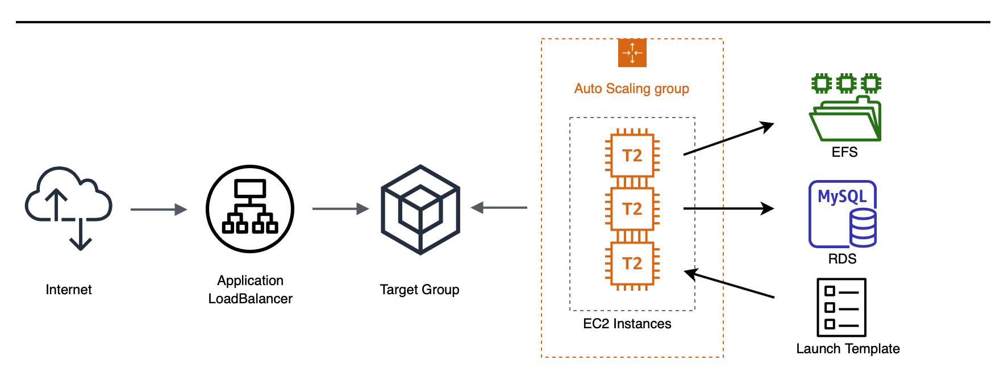
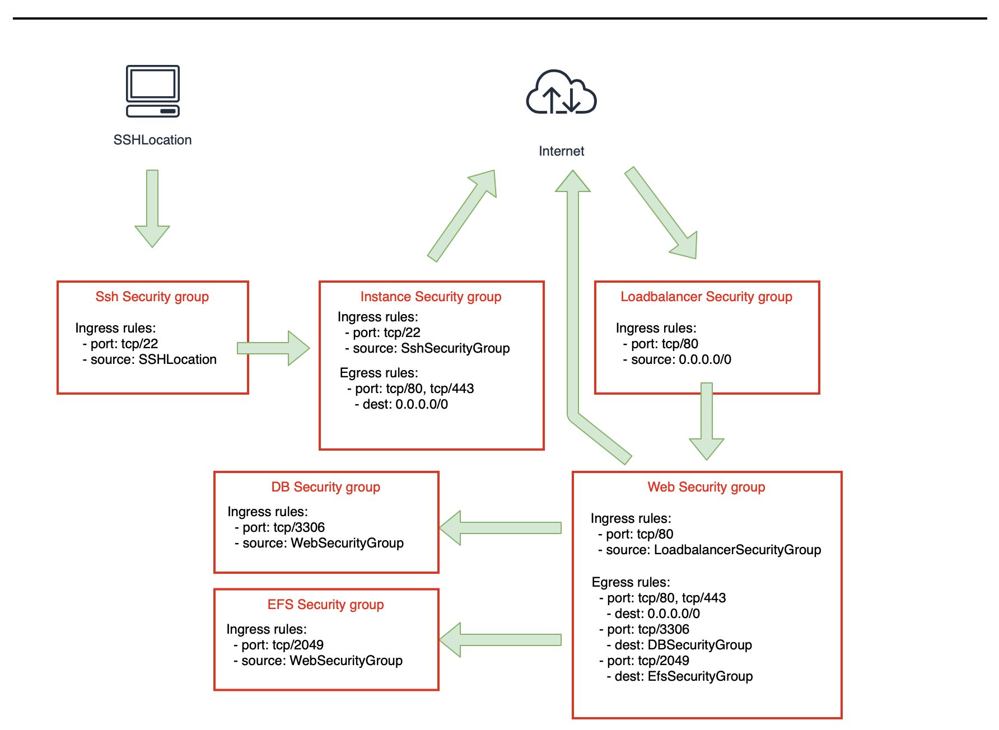
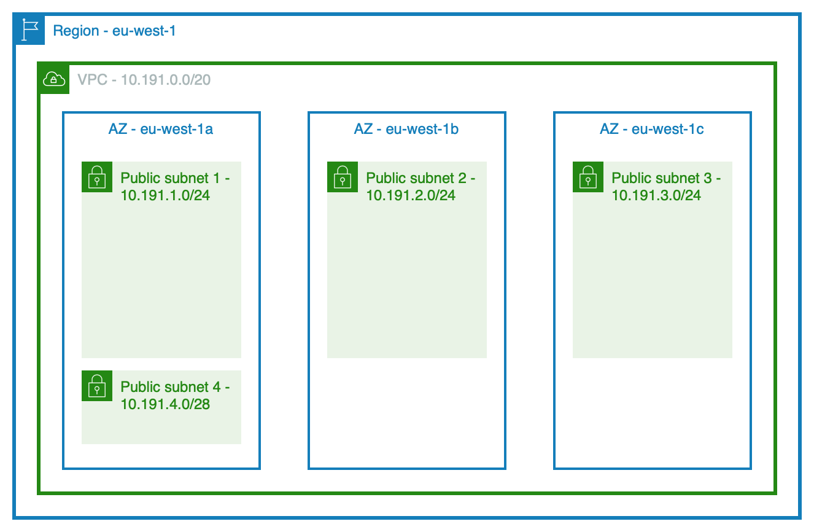
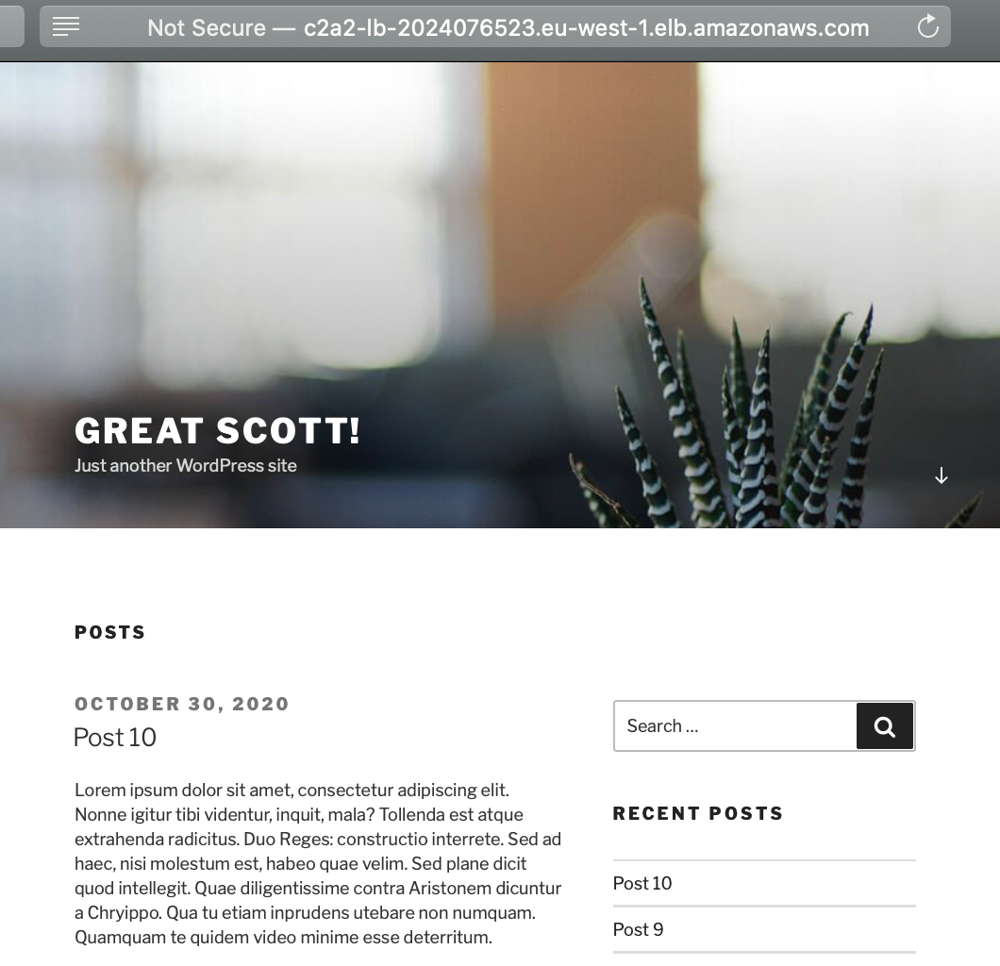

</br>
</br>
</br>
</br>
</br>
</br>
</br>
</br>
</br>
</br>
</br>


<p style="page-break-before: always">

## Innehållsförteckning

<p>
</br>
</br>
</br>
</p>

- **[Inledning](#inledning)**
  - [Översikt](#%C3%B6versikt)
- **[Förutsättningar](#f%C3%B6ruts%C3%A4ttningar)**
- **[CloudFormation Template](#cloudformation-template)**
  - [Metadata](#metadata)
  - [Parameters](#parameters)
  - [Mappings](#mappings)
  - [Resources](#resources)
    - [SecurityGroups Overview](#securitygroups-overview)
    - [Instances Overview](#instances-overview)
      - [Build Instance](#build-instance)
      - [Bastion Instance](#bastion-instance)
    - [Network Overview](#network-overview)
      - [VPC](#vpc)
      - [Internet Gateway](#internet-gateway)
      - [Subnets](#subnets)
      - [Routing](#routing)
    - [Filesystem Overview](#filesystem-overview)
    - [Database Overview](#database-overview)
    - [Loadbalancer](#loadbalancer)
    - [TargetGroup](#targetgroup)
    - [LaunchTemplate](#launchtemplate)
    - [AutoScalingGroup](#autoscalinggroup)
  - [Outputs](#outputs)
- **[Deploy Cloudformation template](#deploy-cloudformation-template)**
- **[Förbättringar](#f%C3%B6rb%C3%A4ttringar)**
- **[Sammanfattning](#sammanfattning)**
- **[Appendix A](#appendix-a)**
  - [GitHub](#gitHub)
- **[Appendix B](#appendix-b)**
  - [c2a2-template.yaml](#c2a2-templateyaml)
  - [c2a2-parameters.json](#c2a2-parametersjson)

<p style="page-break-before: always">

# Inledning

Uppgiften är att skapa en robust, säker och skalbar hosting-miljö för en webbapplikation som använder tjänsterna EFS och RDS.

Jag kommer att använda mig av CloudFormation för att skapa upp miljön där vår webbapplikation, Wordpress,  skall vara tillgänglig från Internet. När det gäller designen så vill jag skapa ett eget VPC med tillhörande subnet i 3 stycken Availibilty Zones. En Apache webbserver kommer att distribueras inom varje subnet via en AutoScalingGroup som använder en LaunchTemplate för att sätta upp varje webbserver på ett korrekt sätt. Instanserna där Apache httpd servern snurrar kommer att montera in en EFS export innehållande webroot:n och även kommunicera med en MySQL databas (AWS RDS) som Wordpress använder som underliggande databas.

### Översikt



För att initiera och konfigurera uppsättningen av Wordpress så behöver jag en separat bygginstans. Bygginstansen sköter uppsättningen av databasen och en grundläggande konfiguration av Wordpress. När det är genomfört så stängs bygginstansen ner och Auto Scaling gruppen tar vid för att i sin tur starta de instanser som skall serva Wordpress ut mot Internet. Jag kommer även att sätta upp en så kallad "bastion" instans för att kunna sköta underhåll av webb instanserna.

När jag beskriver den Cloudformation Template jag använder för att lyckas uppnå en robust, säker och skalbar miljö för vår Wordpress installation kommer jag att dela upp den i mindre delar för att i slutet på dokumentet presentera hela template:n. Template:n har fått namnet `c2a2-template.yaml`. c2a2 är en förkortning av Course 2 Assignment 2.

## Förutsättningar

- En lokal aws client.
- AWS konto med tillbörliga rättigheter.
- AWS Region är bestämd till eu-west-1.
- Instansernas operativsystemet är bestämt till Amazon Linux 2.
- Ett redan skapat keypair i vår AWS Region.

## Cloudformation Template

Template:n inleds med 3 rader.

```yaml
---
AWSTemplateFormatVersion: "2010-09-09"
Description: "Course 2, Assignment 1 - c2a1"
```

1:a raden berättar att det är en yaml fil. 2:a raden bestämmer vilken format version det är på vår template och den 3:e raden är en enkel beskrivning av vår template.

<p style="page-break-before: always">

### Metadata

Denna del av template:n styr hur de olika parametrarna sorteras och presenteras när vi skapar en Cloudformation stack via AWS Console. När vi använder aws-cli på kommandoraden spelar dessa metadata igen roll utan då styr vi vilka värden våra parametrar skall ha via filen `c2a2-parameters.json`.

```yaml
Metadata:
  AWS::CloudFormation::Interface:
    ParameterGroups:
      - Label:
          default: "Database"
        Parameters:
          - DBName
          - DBUser
          - DBPassword
          - DBMasterUser
          - DBMasterPassword
      - Label:
          default: "Security"
        Parameters:
          - KeyName
          - SSHLocation
      - Label:
          default: "Network"
        Parameters:
          - VpcCidr
          - PublicSubnet1Cidr
          - PublicSubnet2Cidr
          - PublicSubnet3Cidr
          - PublicSubnet4Cidr
      - Label:
          default: "Wordpress"
        Parameters:
          - WordpressTitle
          - WordpressAdminName
          - WordpressAdminPasswd
          - WordpressAdminEmail
```

### Parameters

```yaml
Parameters:
# Wordpress
  WordpressTitle:
    Description: Wordpress Title
    Type: String
  WordpressAdminName:
    Description: Wordpress Admin Username
    NoEcho: 'true'
    Type: String
  WordpressAdminPasswd:
    Description: The Wordpress Admin Password
    NoEcho: 'true'
    Type: String
  WordpressAdminEmail:
    Description: The Wordpress Admin Email Address
    Type: String

# Network
  VpcCidr:
    Description: VPC for Storage
    Type: String
    Default: 10.191.0.0/20
  PublicSubnet1Cidr:
    Description: Public Subnet 1 for storage
    Type: String
    Default: 10.191.1.0/24
  PublicSubnet2Cidr:
    Description: Public Subnet 2 for storage
    Type: String
    Default: 10.191.2.0/24
  PublicSubnet3Cidr:
    Description: Public Subnet 3 for storage
    Type: String
    Default: 10.191.3.0/24
  PublicSubnet4Cidr:
    Description: Public Subnet 4 for Build and Bastion Server
    Type: String
    Default: 10.191.4.0/28

# Instance
  InstanceType:
    Description: Enter t2.micro, t2.nano or t3.micro. Default is t2.micro.
    Type: String
    Default: t2.micro
    AllowedValues:
      - t2.micro
      - t2.nano
      - t3.micro

# Private ssh key
  KeyName:
    Description: Name of an existing EC2 KeyPair to enable SSH access to the web server
    Type: AWS::EC2::KeyPair::KeyName
    ConstraintDescription: must be the name of an existing EC2 KeyPair.

# SSH Restrication
  SSHLocation:
    Description: The IP address range that can be used to SSH to the EC2 instances
    Type: String
    MinLength: '9'
    MaxLength: '18'
      #Default: 0.0.0.0/0
    Default: 81.230.68.218/32
    AllowedPattern: (\d{1,3})\.(\d{1,3})\.(\d{1,3})\.(\d{1,3})/(\d{1,2})
    ConstraintDescription: must be a valid IP CIDR range of the form x.x.x.x/x.
# Database
  DBName:
    Description: The WordPress database name
    Type: String
    MinLength: '1'
    MaxLength: '64'
    AllowedPattern: '[a-zA-Z][a-zA-Z0-9]*'
    ConstraintDescription: must begin with a letter and contain only alphanumeric
      characters.
  DBUser:
    NoEcho: 'true'
    Description: The WordPress database admin account username
    Type: String
    MinLength: '1'
    MaxLength: '16'
    AllowedPattern: '[a-zA-Z][a-zA-Z0-9]*'
    ConstraintDescription: must begin with a letter and contain only alphanumeric
      characters.
  DBPassword:
    NoEcho: 'true'
    Description: The WordPress database admin account password
    Type: String
    MinLength: '8'
    MaxLength: '41'
    AllowedPattern: '[a-zA-Z0-9]*'
    ConstraintDescription: must contain only alphanumeric characters.
  DBMasterUser:
    Description: The database Master account username
    Type: String
    MinLength: '1'
    MaxLength: '16'
    AllowedPattern: '[a-zA-Z][a-zA-Z0-9]*'
    ConstraintDescription: must begin with a letter and contain only alphanumeric
      characters.
  DBMasterPassword:
    NoEcho: 'true'
    Description: The MySQL database Master account password
    Type: String
    MinLength: '8'
    MaxLength: '41'
    AllowedPattern: '[a-zA-Z0-9]*'
    ConstraintDescription: must contain only alphanumeric characters.
```

### Mappings

```yaml
Mappings:
  RegionMap:
    eu-west-1:
      AMIAmazon: ami-0bb3fad3c0286ebd5
    eu-north-1:
      AMIAmazon: ami-0653812935d0743fe
```

I Mappings sektionen skapar jag möjligheten att använda vår CloudFormation Template i olika regioner. För tillfället är det bara ami:er för Amazon Linux 2 64-bit x86 som stödjs i templaten:n.

### Resources

Nu kommer vi till själva skapandet av resurser i vår Cloudformation stack. Ordningen i vilken de olika resurserna placeras i tempalte:n har ingen större betydelse förutom att det möjligen blir mer lättläst.

#### SecurityGroups Overview

Vår Cloudformation template skapar upp 6 stycken säkerhetsgrupper vilka styr åtkomsten till de olika beståndsdelarna i uppsättningen. En enkel skiss beskriver relationen dom emellan.



```yaml
   SshSecurityGroup:
    Type: 'AWS::EC2::SecurityGroup'
    Properties:
      GroupName: SshSG-c2a2
      GroupDescription: Enable SSH access via port 22
      VpcId: !Ref VPC
      SecurityGroupIngress:
        - IpProtocol: tcp
          FromPort: '22'
          ToPort: '22'
          CidrIp: !Ref SSHLocation
      Tags:
        - Key: Name
          Value: c2a2 Ssh Security Group
        - Key: Env
          Value: dev

  DBSecurityGroup:
    Type: AWS::EC2::SecurityGroup
    Properties:
      GroupName: MySqlSG-c2a2
      GroupDescription: Open database for access
      VpcId: !Ref VPC
      Tags:
        - Key: Name
          Value: c2a2 DB Security Group
        - Key: Env
          Value: dev
  DBSGInboundRule:
    Type: 'AWS::EC2::SecurityGroupIngress'
    Properties:
      Description: Enable access to MySQL for WebSecurityGroup
      GroupId: !Ref DBSecurityGroup
      IpProtocol: tcp
      FromPort: '3306'
      ToPort: '3306'
      SourceSecurityGroupId: !Ref WebSecurityGroup

  EfsSecurityGroup:
    Type: 'AWS::EC2::SecurityGroup'
    Properties:
      GroupName: EfsSG-c2a2
      GroupDescription: Enable NFS access
      VpcId: !Ref VPC
      Tags:
        - Key: Name
          Value: c2a2 EFS Security Group
        - Key: Env
          Value: dev
  EfsSGInboundRule:
    Type: 'AWS::EC2::SecurityGroupIngress'
    Properties:
      Description: Enable access to NFS export for WebSecurityGroup
      GroupId: !Ref EfsSecurityGroup
      IpProtocol: tcp
      FromPort: '2049'
      ToPort: '2049'
      SourceSecurityGroupId: !Ref WebSecurityGroup

  InstanceSecurityGroup:
    Type: 'AWS::EC2::SecurityGroup'
    Properties:
      GroupName: InstanceSG-c2a2
      GroupDescription: Enable ssh access via port 22 from Bastion and Build servers
      VpcId: !Ref VPC
      SecurityGroupEgress:
        - IpProtocol: tcp
          FromPort: '80'
          ToPort: '80'
          CidrIp: 0.0.0.0/0
        - IpProtocol: tcp
          FromPort: '443'
          ToPort: '443'
          CidrIp: 0.0.0.0/0
      Tags:
        - Key: Name
          Value: c2a2 Instance Security Group
        - Key: Env
          Value: dev
  InstanceSGInboundRule:
    Type: 'AWS::EC2::SecurityGroupIngress'
    Properties:
      Description: Enable access via ssh for SshSecurityGroup
      GroupId: !Ref InstanceSecurityGroup
      IpProtocol: tcp
      FromPort: '22'
      ToPort: '22'
      SourceSecurityGroupId: !Ref SshSecurityGroup

  LoadBalancerSecurityGroup:
    Type: 'AWS::EC2::SecurityGroup'
    Properties:
      GroupName: LoadBalancerSG-c2a2
      GroupDescription: Enable http access via port 80 from Internet
      VpcId: !Ref VPC
      SecurityGroupIngress:
        - IpProtocol: tcp
          FromPort: '80'
          ToPort: '80'
          CidrIp: 0.0.0.0/0
      Tags:
        - Key: Name
          Value: c2a2 Load Balancer Security Group
        - Key: Env
          Value: dev

  WebSecurityGroup:
    Type: 'AWS::EC2::SecurityGroup'
    Properties:
      GroupName: WebSG-c2a2
      GroupDescription: Enable ingress and egress traffic for out webservers
      VpcId: !Ref VPC
      SecurityGroupEgress:
        - IpProtocol: tcp
          FromPort: '80'
          ToPort: '80'
          CidrIp: 0.0.0.0/0
        - IpProtocol: tcp
          FromPort: '443'
          ToPort: '443'
          CidrIp: 0.0.0.0/0
      Tags:
        - Key: Name
          Value: c2a2 Web Security Group
        - Key: Env
          Value: dev
  WebSGInboundRule:
    Type: 'AWS::EC2::SecurityGroupIngress'
    Properties:
      Description: Allow http traffic from the Loadbalancer
      GroupId: !Ref WebSecurityGroup
      IpProtocol: tcp
      FromPort: '80'
      ToPort: '80'
      SourceSecurityGroupId: !GetAtt LoadBalancerSecurityGroup.GroupId
  WebSGOutboundRuleMySql:
    Type: 'AWS::EC2::SecurityGroupEgress'
    Properties:
      Description: Allow traffic to the mysql database
      GroupId: !Ref WebSecurityGroup
      IpProtocol: tcp
      FromPort: '3306'
      ToPort: '3306'
      DestinationSecurityGroupId: !GetAtt DBSecurityGroup.GroupId
  WebSGOutboundRuleNFS:
    Type: 'AWS::EC2::SecurityGroupEgress'
    Properties:
      Description: Allow traffic to NFS export
      GroupId: !Ref WebSecurityGroup
      IpProtocol: tcp
      FromPort: '2049'
      ToPort: '2049'
      DestinationSecurityGroupId: !GetAtt EfsSecurityGroup.GroupId
```

#### Instances Overview

##### Build Instance

Build instansen som skall bygga upp och konfigurera Wordpress applikationen konfigureras med följande yaml kod. Extra intressanta delar är:

###### DependsOn

```yaml
    DependsOn: 
      - AccessPointResource
      - MyDB
      - c2a2LoadBalancer
```

`DependsOn` bestämmer att Build instansen måste vänta på att Databasen, NFS exporten och lastbalanseraren skapas innan Build instansen. Detta är viktigt eftersom dessa resurser måste finnas på plats och vara accessbara av det skript som körs i Build instansens UserData del.

I UserData körs följande kommandon för att uppdatera `/etc/fstab`och sedan montera filsystemet där webbrooten skall placeras:

```bash
# Mount filesystem
echo "${FileSystemResource} /var/www/html efs _netdev,tls,accesspoint=${AccessPointResource} 0 0" >> /etc/fstab
mount -a
```

Och för att skapa upp Wordpress databasen med en användare och korrekta användarrättigheter så körs följande SQL kod:

```bash
# Create and Configure the Database
Q1="CREATE DATABASE IF NOT EXISTS ${DBName};"
Q2="CREATE USER '${DBUser}'@'%' IDENTIFIED BY '${DBPassword}';"
Q3="GRANT ALL PRIVILEGES ON ${DBName}.* TO '${DBUser}'@'%';"
Q4="FLUSH PRIVILEGES;"
SQL="$Q1$Q2$Q3$Q4"
mysql -u ${DBMasterUser} -p${DBMasterPassword} -h ${MyDB.Endpoint.Address} -e "$SQL"
```

För att konfigurera Wordpress från kommandoraden används verktyger wp-cli som laddas ner och installeras. Sedan körs konfigurationen med följande kod:

```bash
wget -q https://raw.githubusercontent.com/wp-cli/builds/gh-pages/phar/wp-cli.phar -O /usr/local/bin/wp && \
chmod +x /usr/local/bin/wp
```

```bash
# Wordpress configuration
wp config create --dbhost=${MyDB.Endpoint.Address} --dbname=${DBName} \
--dbuser=${DBUser} --dbpass=${DBPassword} --path=/var/www/html
wp core install --url=${c2a2LoadBalancer.DNSName} \
--title="${WordpressTitle}" --admin_name=${WordpressAdminName} \
--admin_password=${WordpressAdminPasswd} \
--admin_email=${WordpressAdminEmail} --skip-email --path=/var/www/html
wp post delete 1 --path=/var/www/html
wp theme activate twentyseventeen --path=/var/www/html
curl -N http://loripsum.net/api/5 | wp post generate --post_content \
--count=10 --path=/var/www/html
```

I de sista raderna av UserData signaleras det tillbaka till Cloudformation att alla stegen i UserData är genomförda och att det har gott bra. Detta är viktigt eftersom Auto Scaling gruppen är beroende av att även stegen i UserData har genomförts och inte bara att Build instansen är skapad och uppe. Den allra sista raden stänger ner Build instansen då den inte fyller någon funktion längre.

```bash
# Signal to Cloudformation that we're done here.
/opt/aws/bin/cfn-signal -s true --stack ${AWS::StackName} \
--resource BuildInstance --region ${AWS::Region}
# Signing of
shutdown -h now
```

###### CreationPolicy

CreationPolicy är den del av bygginstansen som tar emot signaleringen ifrån kommandot `cfn-signal`. Eftersom det tar ganska så lång tid att skapa MySQL databasen i AWS RDS tjänsten och sedan installera Wordpress så är `Timeout`värdet satt till 20 minuter. Om inte alla steg har hunnits med inom de 20 så kommer Cloudformation stacken att rullas tillbaka.

```yaml
    CreationPolicy:
      ResourceSignal:
        Timeout: PT20M
```

Det var en beskrivning av några av de saker som sker i Template steget som beskriver bygginstansen. Andra delar att studera nedan är installationen av paket, skapandet av användare, rättigheter på katalogstrukturen och konfiguration av Apache webbservern. 
En kommentar här är att det är inte nödvändigt att `wp-user` får de sudo rättigheter som jag har satt och inte heller behöver det laddas upp ytterligare en public ssh nyckel men det är smidigt att ha under skapandet av instansen.

Här följer hela konfigurationen för bygginstansen:

```yaml
  BuildInstance:
    Type: AWS::EC2::Instance
    DependsOn: 
      - AccessPointResource
      - MyDB
      - c2a2LoadBalancer
    Properties:
      ImageId: !FindInMap [ RegionMap, !Ref "AWS::Region", AMIAmazon ]
      InstanceType: !Ref 'InstanceType'
      KeyName: !Ref 'KeyName'
      SecurityGroupIds:
        - !Ref 'SshSecurityGroup'
        - !Ref 'WebSecurityGroup'
      SubnetId: !Ref 'PublicSubnet4'
      UserData:
        "Fn::Base64": !Sub |
          #!/bin/bash -xe
          yum update -y
          yum install aws-cfn-bootstrap amazon-efs-utils -y
          amazon-linux-extras install lamp-mariadb10.2-php7.2 php7.2 -y
          yum install httpd php-gd -y
          yum clean all
          useradd wp-user
          usermod -aG wheel wp-user
          # Update sudoers
          cat << EOF > /etc/sudoers.d/91-wp-user-user
          # User rules for wp-user user
          wp-user ALL=(ALL) NOPASSWD:ALL
          EOF
          # Add ssh keys
          mkdir /home/wp-user/.ssh
          chown wp-user:wp-user /home/wp-user/.ssh
          chmod 0700 /home/wp-user/.ssh
          echo "ssh-rsa AAAAB3NzaC1yc2EAAAABIwAAAQEAvdlI4/FKOrm6e8zWvFIuBGzqi31et8ExDnrO6L6w5O1JI4S0n5kxcNlTkm0+0I/pa/PWdsg21/IsDPE9DWO+9bEX18zPF8BSBWK2bUkSy9KXeaT2QYW0YTlBvkDW7+tBOlBAXqIp25867XsjR0SBepewDlaHEwhUl+A+TBs+Mdy+WVHR4uyg79yKoKCU5srV/tXGaeUs8W8QfLgjAMCAJpsGQ4b32fZmo8xEnU+q7OsMin32sG7wM6M2kcVF2m4ZEDaPwdCon1VVtU/5bQfxE17aKE5HdSQtJ+iF2ImPSfaFUT72EZvEymJlGuthaBjTyOKmlXtDsQuBh8HfHFxhhQ== martin@macbook-2.local" >> /home/wp-user/.ssh/authorized_keys
          chown wp-user /home/wp-user/.ssh/authorized_keys
          chmod 0600 /home/wp-user/.ssh/authorized_keys
          # Update dir and file permissions
          usermod -a -G apache wp-user
          chown -R wp-user:apache /var/www
          # Mount filesystem
          echo "${FileSystemResource} /var/www/html efs _netdev,tls,accesspoint=${AccessPointResource} 0 0" >> /etc/fstab
          mount -a
          # Download and unpack wordpress
          wget -q https://wordpress.org/latest.tar.gz -O /var/tmp/latest.tar.gz
          tar xfz /var/tmp/latest.tar.gz --no-same-owner --strip-components=1 -C /var/www/html/
          # Set permissions
          chmod 2775 /var/www && find /var/www -type d -exec sudo chmod 2775 {} \;
          # find /var/www -type f -exec sudo chmod 0664 {} \;
          # Install wp-cli
          wget -q https://raw.githubusercontent.com/wp-cli/builds/gh-pages/phar/wp-cli.phar -O /usr/local/bin/wp && chmod +x /usr/local/bin/wp
          # Config httpd.conf
          sed -i '/<Directory "\/var\/www\/html">/,/<\/Directory>/ s/AllowOverride None/AllowOverride all/' /etc/httpd/conf/httpd.conf
          sed -i 's/index.html/index.html index.php/g' /etc/httpd/conf/httpd.conf
          # Create and Configure the Database
          Q1="CREATE DATABASE IF NOT EXISTS ${DBName};"
          Q2="CREATE USER '${DBUser}'@'%' IDENTIFIED BY '${DBPassword}';"
          Q3="GRANT ALL PRIVILEGES ON ${DBName}.* TO '${DBUser}'@'%';"
          Q4="FLUSH PRIVILEGES;"
          SQL="$Q1$Q2$Q3$Q4"
          mysql -u ${DBMasterUser} -p${DBMasterPassword} -h ${MyDB.Endpoint.Address} -e "$SQL"
          # Wordpress configuration
          wp config create --dbhost=${MyDB.Endpoint.Address} --dbname=${DBName} --dbuser=${DBUser} --dbpass=${DBPassword} --path=/var/www/html
          wp core install --url=${c2a2LoadBalancer.DNSName} --title="${WordpressTitle}" --admin_name=${WordpressAdminName} --admin_password=${WordpressAdminPasswd} --admin_email=${WordpressAdminEmail} --skip-email --path=/var/www/html
          wp post delete 1 --path=/var/www/html
          wp theme activate twentyseventeen --path=/var/www/html
          curl -N http://loripsum.net/api/5 | wp post generate --post_content --count=10 --path=/var/www/html
          # Signal to Cloudformation that we're done here.
          /opt/aws/bin/cfn-signal -s true --stack ${AWS::StackName} --resource BuildInstance --region ${AWS::Region}
          # Signing of
          shutdown -h now
      Tags:
        - Key: Name
          Value: c2a2 Build Server
        - Key: Env
          Value: dev
    CreationPolicy:
      ResourceSignal:
        Timeout: PT20M
```

##### Bastion Instance

Bastion instansen skapa och placeras på vårt mindre publika subnät - `PublicSubnet4`. Ingen speciell mjukvara installeras här utan denna instans nyttjas endast för att få access till övriga instanser för underhåll och felsökning. Förslagsvis skulle instansen kunna säkras upp med en installation och konfiguration av `fail2ban`. Detta för att säkra upp ssh beroende på vad som konfigureras i `SshSecurityGroup`.

```yaml
  BastionInstance:
    Type: AWS::EC2::Instance
    Properties:
      ImageId: !FindInMap [ RegionMap, !Ref "AWS::Region", AMIAmazon ]
      InstanceType: !Ref 'InstanceType'
      KeyName: !Ref 'KeyName'
      SecurityGroupIds:
        - !Ref 'SshSecurityGroup'
      SubnetId: !Ref 'PublicSubnet4'
      UserData:
        "Fn::Base64": !Sub |
          #!/bin/bash -xe
          yum update -y
          yum clean all
      Tags:
        - Key: Name
          Value: c2a2 Bastion Server
        - Key: Env
          Value: dev
```

<p style="page-break-before: always">

### Network Overview

Nätverkskonfigurationen består av ett nytt VPC och 4 stycken subnät. Ett /24 subnät i varje Availability Zone plus ett mindre subnät som används av bygginstansen och Bastion instansen.



#### VPC

Ett VPC skapas upp med en referens till parametern `VpcCidr`:

```yaml
  VPC:
    Type: AWS::EC2::VPC
    Properties:
      CidrBlock: !Ref VpcCidr
      EnableDnsSupport: true
      EnableDnsHostnames: true
      Tags:
        - Key: Name
          Value: c2a2 Vpc
        - Key: Env
          Value: dev
```

#### Internet Gateway

En Internet Gateway skapas och kopplas till vårt VPC med hjälp av `InternetGatewayAttachment`.

```yaml
  InternetGateway:
    Type: AWS::EC2::InternetGateway
    Properties:
      Tags:
        - Key: Name
          Value: c2a2 Internet Gateway
        - Key: Env
          Value: dev
  InternetGatewayAttachment:
    Type: AWS::EC2::VPCGatewayAttachment
    Properties:
      InternetGatewayId: !Ref InternetGateway
      VpcId: !Ref VPC
```

#### Subnets

De fyra subnäten skapas, `PublicSubnet1`och `PublicSubnet4` placeras i *Availability Zone 1* medans `PublicSubnet2`och `PublicSubnet3` placeras i respektive *AZ*. 

```yaml
  PublicSubnet1:
    Type: AWS::EC2::Subnet
    Properties:
      VpcId: !Ref VPC
      MapPublicIpOnLaunch: true
      CidrBlock: !Ref PublicSubnet1Cidr
      AvailabilityZone: !Select
        - 0
        - !GetAZs
          Ref: AWS::Region
      Tags:
        - Key: Name
          Value: c2a2 Public Subnet AZ1
        - Key: Env
          Value: dev
  PublicSubnet2:
    Type: AWS::EC2::Subnet
    Properties:
      VpcId: !Ref VPC
      MapPublicIpOnLaunch: true
      CidrBlock: !Ref PublicSubnet2Cidr
      AvailabilityZone: !Select
        - 1
        - !GetAZs
          Ref: AWS::Region
      Tags:
        - Key: Name
          Value: c2a2 Public Subnet AZ2
        - Key: Env
          Value: dev
    PublicSubnet3:
    Type: AWS::EC2::Subnet
    Properties:
      VpcId: !Ref VPC
      MapPublicIpOnLaunch: true
      CidrBlock: !Ref PublicSubnet3Cidr
      AvailabilityZone: !Select
        - 2
        - !GetAZs
          Ref: AWS::Region
      Tags:
        - Key: Name
          Value: c2a2 Public Subnet AZ3
        - Key: Env
          Value: dev
  PublicSubnet4:
    Type: AWS::EC2::Subnet
    Properties:
      VpcId: !Ref VPC
      MapPublicIpOnLaunch: true
      CidrBlock: !Ref PublicSubnet4Cidr
      AvailabilityZone: !Select
        - 0
        - !GetAZs
          Ref: AWS::Region
      Tags:
        - Key: Name
          Value: c2a2 Public Subnet AZ1
        - Key: Env
          Value: dev
```

#### Routing

Den routing som krävs skapas upp med följande parametrar:

```yaml
  PublicRouteTable:
    Type: AWS::EC2::RouteTable
    Properties:
      VpcId: !Ref VPC
      Tags:
        - Key: Name
          Value: c2a2 Public Route Table
        - Key: Env
          Value: dev

  DefaultPublicRoute:
    Type: AWS::EC2::Route
    Properties:
      DestinationCidrBlock: 0.0.0.0/0
      GatewayId: !Ref InternetGateway
      RouteTableId: !Ref PublicRouteTable

  PublicSubnet1RouteTableAssociation:
    Type: AWS::EC2::SubnetRouteTableAssociation
    Properties:
      RouteTableId: !Ref PublicRouteTable
      SubnetId: !Ref PublicSubnet1
  PublicSubnet2RouteTableAssociation:
    Type: AWS::EC2::SubnetRouteTableAssociation
    Properties:
      RouteTableId: !Ref PublicRouteTable
      SubnetId: !Ref PublicSubnet2
  PublicSubnet3RouteTableAssociation:
    Type: AWS::EC2::SubnetRouteTableAssociation
    Properties:
      RouteTableId: !Ref PublicRouteTable
      SubnetId: !Ref PublicSubnet3
  PublicSubnet4RouteTableAssociation:
    Type: AWS::EC2::SubnetRouteTableAssociation
    Properties:
      RouteTableId: !Ref PublicRouteTable
      SubnetId: !Ref PublicSubnet4
```

### Filesystem Overview

Dax att skapa ett filsystem som kan monteras in i vardera webbserver. Först skapas filsystemet och efter det ett `MountTarget` i tre av dom fyra subnäten för att göra filsystemet tillgängligt i varje Availability Zone. Filsystemets `DeletionPolicy` är satt till `Delete` vilket medför att när Cloudformation stack:n tas bort försvinner även filsystemet.

Sista steget är skapandet av en `AccessPoint` som vi monterar in i våra webbservrar på monteringspunkten `/var/www/html`.  Vår accesspoint skapar upp en katalog, `/wordpress` , på filsystemet och tilldelar rättigheter för vår användare *wp-user* med uid `1001` och gruppen *apache* med gid `48` .

```yaml
  FileSystemResource:
    Type: AWS::EFS::FileSystem
    DeletionPolicy: Delete
    Properties:
      BackupPolicy:
        Status: DISABLED
      PerformanceMode: generalPurpose
      Encrypted: true
      FileSysteTags:
        - Key: Name
          Value: c2a2 FileSystem
        - Key: Env
          Value: dev

  MountTargetResource1:
    Type: AWS::EFS::MountTarget
    Properties:
      FileSystemId: !Ref FileSystemResource
      SubnetId: !Ref PublicSubnet1
      SecurityGroups:
        - Ref: EfsSecurityGroup
  MountTargetResource2:
    Type: AWS::EFS::MountTarget
    Properties:
      FileSystemId: !Ref FileSystemResource
      SubnetId: !Ref PublicSubnet2
      SecurityGroups:
        - Ref: EfsSecurityGroup
  MountTargetResource3:
    Type: AWS::EFS::MountTarget
    Properties:
      FileSystemId: !Ref FileSystemResource
      SubnetId: !Ref PublicSubnet3
      SecurityGroups:
        - Ref: EfsSecurityGroup

  AccessPointResource:
    Type: 'AWS::EFS::AccessPoint'
    Properties:
      FileSystemId: !Ref FileSystemResource
      PosixUser:
        Uid: "1001"
        Gid: "48"
      RootDirectory:
        CreationInfo:
          OwnerUid: "1001"
          OwnerGid: "48"
          Permissions: "2775"
        Path: "/wordpress"
      AccesspointTags:
        - Key: Name
          Value: c2a2 Accesspoint
```

### Database Overview

För att skapa upp vår MySQL databas använder vi en Amazon RDS database instance. Denna delen bestäms via vår parameters fil även Master användare och lösenord för databasinstansen. Jag refererar även till `MyRDSParamGroup` men jag sätter dock inga specifika värden här men i en produktionsmiljö skulle det kunna vara aktuellt. Jag behåller det som en referens inför framtiden.

Jag ser även till att databasen blir redundant med hänseende på att den blir synlig i alla tre AZ med hjälp av parametrarna i `MyDBSubnetGroup` .

```yaml
  MyDB:
    Type: AWS::RDS::DBInstance
    Properties:
      AllocatedStorage: '20'
      DBInstanceClass: db.t2.micro
      DBInstanceIdentifier: mydb
      DBSubnetGroupName: !Ref 'MyDBSubnetGroup'
      Engine: MySQL
      EngineVersion: 8.0.20
      MasterUsername: !Ref 'DBMasterUser'
      MasterUserPassword: !Ref 'DBMasterPassword'
      DBParameterGroupName: !Ref 'MyRDSParamGroup'
      VPCSecurityGroups:
        - !Ref DBSecurityGroup
      Tags:
        - Key: Name
          Value: c2a2 DB
    DeletionPolicy: Delete
  MyRDSParamGroup:
    Type: AWS::RDS::DBParameterGroup
    Properties:
      Family: mysql8.0
      Description: CloudFormation Database Parameter Group
  MyDBSubnetGroup:
    Type: AWS::RDS::DBSubnetGroup
    Properties:
      DBSubnetGroupName: MyDBSubnetGroup
      DBSubnetGroupDescription: 'DB Subnets'
      SubnetIds:
        - !Ref PublicSubnet1
        - !Ref PublicSubnet2
        - !Ref PublicSubnet3
      Tags:
        - Key: Name
          Value: c2a2 DB Subnet Group
```

### Loadbalancer

En lastbalanserare skapas och de tre subnet där vi kommer att initera instanser för vår webbapplikation konfigureras. Även en referens till en säkerhetsgrupp specas, `LoadBalancerSecurityGroup`, denna tillåter tcp trafik på port 80. 

`LoadbalancerListener`skapar kopplingen mellan lastbalanseraren och vår TargetGroup. Skulle vi vilja använda ett SSL/TLS certifikat för att säkra kommunikationen mellan klient och lastbalanseraren så är det här som det konfigureras. 

```yaml
  c2a2LoadBalancer:
    Type: AWS::ElasticLoadBalancingV2::LoadBalancer
    DependsOn: VPC
    Properties:
      Name: c2a2-lb
      Subnets:
        - !Ref PublicSubnet1
        - !Ref PublicSubnet2
        - !Ref PublicSubnet3
      SecurityGroups:
        - !Ref LoadBalancerSecurityGroup
      Tags:
        - Key: Name
          Value: c2a2 Load Balancer
        - Key: Env
          Value: dev

  LoadBalancerListener:
    Type: AWS::ElasticLoadBalancingV2::Listener
    Properties:
      LoadBalancerArn: !Ref c2a2LoadBalancer
      Port: 80
      Protocol: HTTP
      DefaultActions:
        - Type: forward
          TargetGroupArn: !Ref TargetGroup
```

### TargetGroup

Som skissen i inledningen av detta dokument visade så behövs en TargetGroup där lastbalanseraren förväntar sig att det finns ett antal instanser att lastdela emellan. Det är AutoScaling gruppen som kommer att placera instanserna i Target gruppen.

```yaml
  TargetGroup:
    Type: AWS::ElasticLoadBalancingV2::TargetGroup
    Properties:
      Name: c2a2TargetGroup
      VpcId: !Ref VPC
      Port: '80'
      Protocol: HTTP
      Tags:
        - Key: Name
          Value: c2a2 Target Group
        - Key: Env
          Value: dev
```

### LaunchTemplate

LaunchTemplate:n används av AutoScaling gruppen för att skapa upp nya instanser. I UserData körs ett bash skript som installerar de nödvändiga paketen för att vi skall kunna köra Wordpress på de färdiga instanserna. Även användare och grupper skapas. Vi monterar filsystemet där bygginstansen sedan tidigare har lagt Wordpress applikationens filer. Det sista som sker i UserData är att vi startar httpd service:n

```yaml
  LaunchTemplate:
    Type: AWS::EC2::LaunchTemplate
    Properties:
      LaunchTemplateData:
        InstanceType: !Ref InstanceType
        ImageId: !FindInMap [ RegionMap, !Ref "AWS::Region", AMIAmazon ]
        KeyName: !Ref KeyName
        SecurityGroupIds:
          - !GetAtt InstanceSecurityGroup.GroupId
          - !GetAtt WebSecurityGroup.GroupId
        TagSpecifications:
        - ResourceType: instance
          Tags:
          - Key: Name
            Value: c2a2 Web Instance
          - Key: Env
            Value: dev
        UserData:
          "Fn::Base64": !Sub |
            #!/bin/bash -xe
            yum update -y
            yum install amazon-efs-utils -y
            amazon-linux-extras install lamp-mariadb10.2-php7.2 php7.2 -y
            yum install httpd php-gd -y
            yum clean all
            # Create Wordpress user
            useradd wp-user
            # Update dir and file permissions
            usermod -a -G apache wp-user
            chown -R wp-user:apache /var/www
            # create mount point
            echo "${FileSystemResource} /var/www/html efs _netdev,tls,accesspoint=${AccessPointResource} 0 0" >> /etc/fstab
            mount -a
            # Config httpd.conf
            sed -i '/<Directory "\/var\/www\/html">/,/<\/Directory>/ s/AllowOverride None/AllowOverride all/' /etc/httpd/conf/httpd.conf
            sed -i 's/index.html/index.html index.php/g' /etc/httpd/conf/httpd.conf
            # Enable and start the httpd services
            systemctl enable httpd
            systemctl start httpd
      LaunchTemplateName: c2a2-template
```

### AutoScalingGroup

AutoScaling gruppen kommer att använda en LaunchTemplate för att skapa upp det antal instanser som bestäms av `DesiredCapacity` och logiskt koppla dessa till vår TargetGroup. Vi har även direktivet `DependsOn` satt här som bestämmer att `BuildInstance`måste hunnit skapats och blivit klar innan AutoScaling gruppen med sina instanser skapas.

```yaml
  c2a2ASG:
    Type: AWS::AutoScaling::AutoScalingGroup
    DependsOn:
      - BuildInstance
    Properties:
      AutoScalingGroupName: c2a2-ASG
      AvailabilityZones:
        - "eu-west-1a"
        - "eu-west-1b"
        - "eu-west-1c"
      MinSize: '0'
      MaxSize: '6'
      DesiredCapacity: '2'
      LaunchTemplate:
        LaunchTemplateId: !Ref LaunchTemplate
        Version: !GetAtt LaunchTemplate.LatestVersionNumber
      TargetGroupARNs:
        - !Ref TargetGroup
      VPCZoneIdentifier:
        - !Ref PublicSubnet1
        - !Ref PublicSubnet2
        - !Ref PublicSubnet3
      Tags:
        - Key: Name
          Value: c2a2 Auto Scaling Group
          PropagateAtLaunch: 'false'
        - Key: Env
          Value: dev
          PropagateAtLaunch: 'true'
```

### Outputs

I Outputs sektionen plockar vi fram den URL som vi behöver för att kunna testa att webbapplikationen fungerar som tänkt och den publika ipadressen till vår Bastion instans.

```yaml
Outputs:
  BastionInstanceIp:
    Description: The Ip address of the Bastion Instance.
    Value: !GetAtt BastionInstance.PublicIp

  LoadBalancerUrl:
    Description: The URL of the ALB
    Value: !GetAtt c2a2LoadBalancer.DNSName
```

## Deploy Cloudformation template

Skapa stacken:

```bash
aws cloudformation create-stack --stack-name c2a2-stack --template-body file://c2a2-template.yaml --parameters file://c2a2-parameters.json
```

Visa output:

```bash
aws cloudformation describe-stacks --stack-name c2a2-stack --query "Stacks[*].Outputs" --output json
```

Testa att komma åt vår Wordpress installation via den URL:n som presenteras som LoadbalancerUrl ifrån output kommandot ovan. 

Exempel:

```json
{
    "OutputKey": "LoadBalancerUrl"
    "OutputValue": "c2a2-lb-2024076523.eu-west-1.elb.amazonaws.com",
    "Description": "The URL of the ALB"
},
```



Ta bort stack:n

```bash
aws cloudformation delete-stack --stack-name c2a2-stack
```

## Förbättringar

- Möjligheten att använda andra Linux distributioner än Amazon Linux 2 t.ex CentOS.

- Använda ett Configuration Management system som t.ex Ansible istället för att använda bash skript i UserData. Fördelen med en sådan lösning skulle bl.a. vara att   verktygen har inbyggd felhantering och kan rent kodmässigt hanteras helt skilt ifrån Cloudformation stack:n. Har man en Ansible Playbook som säkrar upp maskinerna i Azure eller On-prem så kan samma playbook användas hos AWS för att säkra instanserna enligt nån standard som vi vill följa.

- Centraliserad loggning med hjälp av CloudWatch.

- Lagra användare och lösenord i Parameter Store istället för att ha den typen av data i c2a2-parameters.json. 

- Använda en CI/CD pipeline för att skapa och underhålla Wordpress installationen.

- Backup/snapshots av EFS filsystemet och MySQL Databasen

## Sammanfattning

Denna uppgift skapade ytterligare lite mer komplexitet till vår CloudFormation template jämfört med den i förra inlämningsuppgiften. Vi börjar närma oss de beståndsdelar och scenarion som nyttjas ute i verkligheten. En persistent filarea och en databas skapar ytterligare en dimension till vår uppsättning. 

Jag tycker att jag lyckats skapa en template som inte har så många externa beroende förutom de som specas under rubriken *Förutsättningar*. Det borde fungera för nån annan person att använder min template i syfte att skapa en robust, säker och skalbar Wordpress-miljö, bara personen ifråga uppdaterar c2a2-parameters.json med relevant data. 

Jag har pekat på några förbättringar som skulle kunna göras till miljön, det går som vanligt att göra saker väldigt komplexa och tillkrånglade men genom att vi försöker skapa infrastruktur med kod kan flera personer samarbeta och tillföra sin erfarenhet och kunskap till uppgiften. 

<p style="page-break-before: always">

## Appendix A

#### GitHub

På GitHub finns den CloudFormation Template som jag försökt beskriva här plus detta dokument.
Följ länken: [GitHub - martyV/amazon-aws-kurs/course2/assignment2]([amazon-aws-kurs/course2/assignment2 at master · martyV/amazon-aws-kurs · GitHub](https://github.com/martyV/amazon-aws-kurs/tree/master/course2/assignment2)) eller klona repot: `git clone https://github.com/martyV/amazon-aws-kurs.git`. 

<p style="page-break-before: always">

## Appendix B

### c2a2-template.yaml

```yaml
---
AWSTemplateFormatVersion: "2010-09-09"
Description: "Course 2, Assignment 2 - c2a2"
Metadata:
  AWS::CloudFormation::Interface:
    ParameterGroups:
      - Label:
          default: "Database"
        Parameters:
          - DBName
          - DBUser
          - DBPassword
          - DBMasterUser
          - DBMasterPassword
      - Label:
          default: "Security"
        Parameters:
          - KeyName
          - SSHLocation
      - Label:
          default: "Network"
        Parameters:
          - VpcCidr
          - PublicSubnet1Cidr
          - PublicSubnet2Cidr
          - PublicSubnet3Cidr
          - PublicSubnet4Cidr
      - Label:
          default: "Wordpress"
        Parameters:
          - WordpressTitle
          - WordpressAdminName
          - WordpressAdminPasswd
          - WordpressAdminEmail
Parameters:
# Wordpress
  WordpressTitle:
    Description: Wordpress Title
    Type: String
  WordpressAdminName:
    Description: Wordpress Admin Username
    NoEcho: 'true'
    Type: String
  WordpressAdminPasswd:
    Description: The Wordpress Admin Password
    NoEcho: 'true'
    Type: String
  WordpressAdminEmail:
    Description: The Wordpress Admin Email Address
    Type: String
# Network
  VpcCidr:
    Description: VPC for Storage
    Type: String
    Default: 10.191.0.0/20
  PublicSubnet1Cidr:
    Description: Public Subnet 1 for storage
    Type: String
    Default: 10.191.1.0/24
  PublicSubnet2Cidr:
    Description: Public Subnet 2 for storage
    Type: String
    Default: 10.191.2.0/24
  PublicSubnet3Cidr:
    Description: Public Subnet 3 for storage
    Type: String
    Default: 10.191.3.0/24
  PublicSubnet4Cidr:
    Description: Public Subnet 4 for Build and Bastion Server
    Type: String
    Default: 10.191.4.0/28

# Instance
  InstanceType:
    Description: Enter t2.micro, t2.nano or t3.micro. Default is t2.micro.
    Type: String
    Default: t2.micro
    AllowedValues:
      - t2.micro
      - t2.nano
      - t3.micro

# Private ssh key
  KeyName:
    Description: Name of an existing EC2 KeyPair to enable SSH access to the web server
    Type: AWS::EC2::KeyPair::KeyName
    ConstraintDescription: must be the name of an existing EC2 KeyPair.

# SSH Restrication
  SSHLocation:
    Description: The IP address range that can be used to SSH to the EC2 instances
    Type: String
    MinLength: '9'
    MaxLength: '18'
      #Default: 0.0.0.0/0
    Default: 81.230.68.218/32
    AllowedPattern: (\d{1,3})\.(\d{1,3})\.(\d{1,3})\.(\d{1,3})/(\d{1,2})
    ConstraintDescription: must be a valid IP CIDR range of the form x.x.x.x/x.
# Database
  DBName:
    Description: The WordPress database name
    Type: String
    MinLength: '1'
    MaxLength: '64'
    AllowedPattern: '[a-zA-Z][a-zA-Z0-9]*'
    ConstraintDescription: must begin with a letter and contain only alphanumeric
      characters.
  DBUser:
    NoEcho: 'true'
    Description: The WordPress database admin account username
    Type: String
    MinLength: '1'
    MaxLength: '16'
    AllowedPattern: '[a-zA-Z][a-zA-Z0-9]*'
    ConstraintDescription: must begin with a letter and contain only alphanumeric
      characters.
  DBPassword:
    NoEcho: 'true'
    Description: The WordPress database admin account password
    Type: String
    MinLength: '8'
    MaxLength: '41'
    AllowedPattern: '[a-zA-Z0-9]*'
    ConstraintDescription: must contain only alphanumeric characters.
  DBMasterUser:
    Description: The database Master account username
    Type: String
    MinLength: '1'
    MaxLength: '16'
    AllowedPattern: '[a-zA-Z][a-zA-Z0-9]*'
    ConstraintDescription: must begin with a letter and contain only alphanumeric
      characters.
  DBMasterPassword:
    NoEcho: 'true'
    Description: The MySQL database Master account password
    Type: String
    MinLength: '8'
    MaxLength: '41'
    AllowedPattern: '[a-zA-Z0-9]*'
    ConstraintDescription: must contain only alphanumeric characters.

Mappings:
  RegionMap:
    eu-west-1:
      AMIAmazon: ami-0bb3fad3c0286ebd5
    eu-north-1:
      AMIAmazon: ami-0653812935d0743fe

Resources:
  SshSecurityGroup:
    Type: 'AWS::EC2::SecurityGroup'
    Properties:
      GroupName: SshSG-c2a2
      GroupDescription: Enable SSH access via port 22
      VpcId: !Ref VPC
      SecurityGroupIngress:
        - IpProtocol: tcp
          FromPort: '22'
          ToPort: '22'
          CidrIp: !Ref SSHLocation
      Tags:
        - Key: Name
          Value: c2a2 Ssh Security Group
        - Key: Env
          Value: dev

  DBSecurityGroup:
    Type: AWS::EC2::SecurityGroup
    Properties:
      GroupName: MySqlSG-c2a2
      GroupDescription: Open database for access
      VpcId: !Ref VPC
      Tags:
        - Key: Name
          Value: c2a2 DB Security Group
        - Key: Env
          Value: dev
  DBSGInboundRule:
    Type: 'AWS::EC2::SecurityGroupIngress'
    Properties:
      Description: Enable access to MySQL for WebsecurityGroup
      GroupId: !Ref DBSecurityGroup
      IpProtocol: tcp
      FromPort: '3306'
      ToPort: '3306'
      SourceSecurityGroupId: !Ref WebSecurityGroup

  EfsSecurityGroup:
    Type: 'AWS::EC2::SecurityGroup'
    Properties:
      GroupName: EfsSG-c2a2
      GroupDescription: Enable NFS access
      VpcId: !Ref VPC
      Tags:
        - Key: Name
          Value: c2a2 EFS Security Group
        - Key: Env
          Value: dev
  EfsSGInboundRule:
    Type: 'AWS::EC2::SecurityGroupIngress'
    Properties:
      Description: Enable access to NFS export for WebSecurityGroup
      GroupId: !Ref EfsSecurityGroup
      IpProtocol: tcp
      FromPort: '2049'
      ToPort: '2049'
      SourceSecurityGroupId: !Ref WebSecurityGroup

  InstanceSecurityGroup:
    Type: 'AWS::EC2::SecurityGroup'
    Properties:
      GroupName: InstanceSG-c2a2
      GroupDescription: Enable ssh access via port 22 from Bastion and Build servers
      VpcId: !Ref VPC
      SecurityGroupEgress:
        - IpProtocol: tcp
          FromPort: '80'
          ToPort: '80'
          CidrIp: 0.0.0.0/0
        - IpProtocol: tcp
          FromPort: '443'
          ToPort: '443'
          CidrIp: 0.0.0.0/0
      Tags:
        - Key: Name
          Value: c2a2 Instance Security Group
        - Key: Env
          Value: dev
  InstanceSGInboundRule:
    Type: 'AWS::EC2::SecurityGroupIngress'
    Properties:
      Description: Enable access via ssh for SshSecurityGroup
      GroupId: !Ref InstanceSecurityGroup
      IpProtocol: tcp
      FromPort: '22'
      ToPort: '22'
      SourceSecurityGroupId: !Ref SshSecurityGroup

  LoadBalancerSecurityGroup:
    Type: 'AWS::EC2::SecurityGroup'
    Properties:
      GroupName: LoadBalancerSG-c2a2
      GroupDescription: Enable http access via port 80 from Internet
      VpcId: !Ref VPC
      SecurityGroupIngress:
        - IpProtocol: tcp
          FromPort: '80'
          ToPort: '80'
          CidrIp: 0.0.0.0/0
      Tags:
        - Key: Name
          Value: c2a2 Load Balancer Security Group
        - Key: Env
          Value: dev

  WebSecurityGroup:
    Type: 'AWS::EC2::SecurityGroup'
    Properties:
      GroupName: WebSG-c2a2
      GroupDescription: Enable Web access via port 80
      VpcId: !Ref VPC
      SecurityGroupEgress:
        - IpProtocol: tcp
          FromPort: '80'
          ToPort: '80'
          CidrIp: 0.0.0.0/0
        - IpProtocol: tcp
          FromPort: '443'
          ToPort: '443'
          CidrIp: 0.0.0.0/0
      Tags:
        - Key: Name
          Value: c2a2 Web Security Group
        - Key: Env
          Value: dev
  WebSGInboundRule:
    Type: 'AWS::EC2::SecurityGroupIngress'
    Properties:
      GroupId: !Ref WebSecurityGroup
      IpProtocol: tcp
      FromPort: '80'
      ToPort: '80'
      SourceSecurityGroupId: !GetAtt LoadBalancerSecurityGroup.GroupId
  WebSGOutboundRuleMySql:
    Type: 'AWS::EC2::SecurityGroupEgress'
    Properties:
      Description: Allow traffic to the mysql database
      GroupId: !Ref WebSecurityGroup
      IpProtocol: tcp
      FromPort: '3306'
      ToPort: '3306'
      DestinationSecurityGroupId: !GetAtt DBSecurityGroup.GroupId
  WebSGOutboundRuleNFS:
    Type: 'AWS::EC2::SecurityGroupEgress'
    Properties:
      Description: Allow traffic to NFS export
      GroupId: !Ref WebSecurityGroup
      IpProtocol: tcp
      FromPort: '2049'
      ToPort: '2049'
      DestinationSecurityGroupId: !GetAtt EfsSecurityGroup.GroupId

# Instances
  BuildInstance:
    Type: AWS::EC2::Instance
    DependsOn:
      - AccessPointResource
      - MyDB
    Properties:
      ImageId: !FindInMap [ RegionMap, !Ref "AWS::Region", AMIAmazon ]
      InstanceType: !Ref 'InstanceType'
      KeyName: !Ref 'KeyName'
      SecurityGroupIds:
        - !Ref 'SshSecurityGroup'
        - !Ref 'WebSecurityGroup'
      SubnetId: !Ref 'PublicSubnet4'
      UserData:
        "Fn::Base64": !Sub |
          #!/bin/bash -xe
          yum update -y
          yum install aws-cfn-bootstrap amazon-efs-utils -y
          amazon-linux-extras install lamp-mariadb10.2-php7.2 php7.2 -y
          yum install httpd php-gd -y
          yum clean all
          useradd wp-user
          usermod -aG wheel wp-user
          # Update sudoers
          cat << EOF > /etc/sudoers.d/91-wp-user-user
          # User rules for wp-user user
          wp-user ALL=(ALL) NOPASSWD:ALL
          EOF
          # Add ssh keys
          mkdir /home/wp-user/.ssh
          chown wp-user:wp-user /home/wp-user/.ssh
          chmod 0700 /home/wp-user/.ssh
          echo "ssh-rsa AAAAB3NzaC1yc2EAAAABIwAAAQEAvdlI4/FKOrm6e8zWvFIuBGzqi31et8ExDnrO6L6w5O1JI4S0n5kxcNlTkm0+0I/pa/PWdsg21/IsDPE9DWO+9bEX18zPF8BSBWK2bUkSy9KXeaT2QYW0YTlBvkDW7+tBOlBAXqIp25867XsjR0SBepewDlaHEwhUl+A+TBs+Mdy+WVHR4uyg79yKoKCU5srV/tXGaeUs8W8QfLgjAMCAJpsGQ4b32fZmo8xEnU+q7OsMin32sG7wM6M2kcVF2m4ZEDaPwdCon1VVtU/5bQfxE17aKE5HdSQtJ+iF2ImPSfaFUT72EZvEymJlGuthaBjTyOKmlXtDsQuBh8HfHFxhhQ== martin@macbook-2.local" >> /home/wp-user/.ssh/authorized_keys
          chown wp-user /home/wp-user/.ssh/authorized_keys
          chmod 0600 /home/wp-user/.ssh/authorized_keys
          # Update dir and file permissions
          usermod -a -G apache wp-user
          chown -R wp-user:apache /var/www
          # Mount filesystem
          echo "${FileSystemResource} /var/www/html efs _netdev,tls,accesspoint=${AccessPointResource} 0 0" >> /etc/fstab
          mount -a
          # Download and unpack wordpress
          wget -q https://wordpress.org/latest.tar.gz -O /var/tmp/latest.tar.gz
          tar xfz /var/tmp/latest.tar.gz --no-same-owner --strip-components=1 -C /var/www/html/
          # Set permissions
          chmod 2775 /var/www && find /var/www -type d -exec sudo chmod 2775 {} \;
          # find /var/www -type f -exec sudo chmod 0664 {} \;
          # Install wp-cli
          wget -q https://raw.githubusercontent.com/wp-cli/builds/gh-pages/phar/wp-cli.phar -O /usr/local/bin/wp && chmod +x /usr/local/bin/wp
          # Config httpd.conf
          sed -i '/<Directory "\/var\/www\/html">/,/<\/Directory>/ s/AllowOverride None/AllowOverride all/' /etc/httpd/conf/httpd.conf
          sed -i 's/index.html/index.html index.php/g' /etc/httpd/conf/httpd.conf
          # Create and Configure the Database
          Q1="CREATE DATABASE IF NOT EXISTS ${DBName};"
          Q2="CREATE USER '${DBUser}'@'%' IDENTIFIED BY '${DBPassword}';"
          Q3="GRANT ALL PRIVILEGES ON ${DBName}.* TO '${DBUser}'@'%';"
          Q4="FLUSH PRIVILEGES;"
          SQL="$Q1$Q2$Q3$Q4"
          mysql -u ${DBMasterUser} -p${DBMasterPassword} -h ${MyDB.Endpoint.Address} -e "$SQL"
          # Wordpress configuration
          wp config create --dbhost=${MyDB.Endpoint.Address} --dbname=${DBName} --dbuser=${DBUser} --dbpass=${DBPassword} --path=/var/www/html
          wp core install --url=${c2a2LoadBalancer.DNSName} --title="${WordpressTitle}" --admin_name=${WordpressAdminName} --admin_password=${WordpressAdminPasswd} --admin_email=${WordpressAdminEmail} --skip-email --path=/var/www/html
          wp post delete 1 --path=/var/www/html
          wp theme activate twentyseventeen --path=/var/www/html
          curl -N http://loripsum.net/api/5 | wp post generate --post_content --count=10 --path=/var/www/html
          # Signal to Cloudformation that we're done here.
          /opt/aws/bin/cfn-signal -s true --stack ${AWS::StackName} --resource BuildInstance --region ${AWS::Region}
          # Signing of
          shutdown -h now
      Tags:
        - Key: Name
          Value: c2a2 Build Server
        - Key: Env
          Value: dev
    CreationPolicy:
      ResourceSignal:
        Timeout: PT20M

  BastionInstance:
    Type: AWS::EC2::Instance
    Properties:
      ImageId: !FindInMap [ RegionMap, !Ref "AWS::Region", AMIAmazon ]
      InstanceType: !Ref 'InstanceType'
      KeyName: !Ref 'KeyName'
      SecurityGroupIds:
        - !Ref 'SshSecurityGroup'
      SubnetId: !Ref 'PublicSubnet4'
      UserData:
        "Fn::Base64": !Sub |
          #!/bin/bash -xe
          yum update -y
          yum clean all
      Tags:
        - Key: Name
          Value: c2a2 Bastion Server
        - Key: Env
          Value: dev

# Network
  VPC:
    Type: AWS::EC2::VPC
    Properties:
      CidrBlock: !Ref VpcCidr
      EnableDnsSupport: true
      EnableDnsHostnames: true
      Tags:
        - Key: Name
          Value: c2a2 Vpc
        - Key: Env
          Value: dev

  InternetGateway:
    Type: AWS::EC2::InternetGateway
    Properties:
      Tags:
        - Key: Name
          Value: c2a2 Internet Gateway
        - Key: Env
          Value: dev
  InternetGatewayAttachment:
    Type: AWS::EC2::VPCGatewayAttachment
    Properties:
      InternetGatewayId: !Ref InternetGateway
      VpcId: !Ref VPC

  PublicSubnet1:
    Type: AWS::EC2::Subnet
    Properties:
      VpcId: !Ref VPC
      MapPublicIpOnLaunch: true
      CidrBlock: !Ref PublicSubnet1Cidr
      AvailabilityZone: !Select
        - 0
        - !GetAZs
          Ref: AWS::Region
      Tags:
        - Key: Name
          Value: c2a2 Public Subnet AZ1
        - Key: Env
          Value: dev
  PublicSubnet2:
    Type: AWS::EC2::Subnet
    Properties:
      VpcId: !Ref VPC
      MapPublicIpOnLaunch: true
      CidrBlock: !Ref PublicSubnet2Cidr
      AvailabilityZone: !Select
        - 1
        - !GetAZs
          Ref: AWS::Region
      Tags:
        - Key: Name
          Value: c2a2 Public Subnet AZ2
        - Key: Env
          Value: dev
  PublicSubnet3:
    Type: AWS::EC2::Subnet
    Properties:
      VpcId: !Ref VPC
      MapPublicIpOnLaunch: true
      CidrBlock: !Ref PublicSubnet3Cidr
      AvailabilityZone: !Select
        - 2
        - !GetAZs
          Ref: AWS::Region
      Tags:
        - Key: Name
          Value: c2a2 Public Subnet AZ3
        - Key: Env
          Value: dev
  PublicSubnet4:
    Type: AWS::EC2::Subnet
    Properties:
      VpcId: !Ref VPC
      MapPublicIpOnLaunch: true
      CidrBlock: !Ref PublicSubnet4Cidr
      AvailabilityZone: !Select
        - 0
        - !GetAZs
          Ref: AWS::Region
      Tags:
        - Key: Name
          Value: c2a2 Public Subnet AZ1
        - Key: Env
          Value: dev

  PublicRouteTable:
    Type: AWS::EC2::RouteTable
    Properties:
      VpcId: !Ref VPC
      Tags:
        - Key: Name
          Value: c2a2 Public Route Table
        - Key: Env
          Value: dev

  DefaultPublicRoute:
    Type: AWS::EC2::Route
    Properties:
      DestinationCidrBlock: 0.0.0.0/0
      GatewayId: !Ref InternetGateway
      RouteTableId: !Ref PublicRouteTable

  PublicSubnet1RouteTableAssociation:
    Type: AWS::EC2::SubnetRouteTableAssociation
    Properties:
      RouteTableId: !Ref PublicRouteTable
      SubnetId: !Ref PublicSubnet1
  PublicSubnet2RouteTableAssociation:
    Type: AWS::EC2::SubnetRouteTableAssociation
    Properties:
      RouteTableId: !Ref PublicRouteTable
      SubnetId: !Ref PublicSubnet2
  PublicSubnet3RouteTableAssociation:
    Type: AWS::EC2::SubnetRouteTableAssociation
    Properties:
      RouteTableId: !Ref PublicRouteTable
      SubnetId: !Ref PublicSubnet3
  PublicSubnet4RouteTableAssociation:
    Type: AWS::EC2::SubnetRouteTableAssociation
    Properties:
      RouteTableId: !Ref PublicRouteTable
      SubnetId: !Ref PublicSubnet4

# EFS
  FileSystemResource:
    Type: AWS::EFS::FileSystem
    DeletionPolicy: Delete
    Properties:
      BackupPolicy:
        Status: DISABLED
      PerformanceMode: generalPurpose
      Encrypted: true
      FileSystemTags:
        - Key: Name
          Value: c2a2 FileSystem

  MountTargetResource1:
    Type: AWS::EFS::MountTarget
    Properties:
      FileSystemId: !Ref FileSystemResource
      SubnetId: !Ref PublicSubnet1
      SecurityGroups:
        - Ref: EfsSecurityGroup
  MountTargetResource2:
    Type: AWS::EFS::MountTarget
    Properties:
      FileSystemId: !Ref FileSystemResource
      SubnetId: !Ref PublicSubnet2
      SecurityGroups:
        - Ref: EfsSecurityGroup
  MountTargetResource3:
    Type: AWS::EFS::MountTarget
    Properties:
      FileSystemId: !Ref FileSystemResource
      SubnetId: !Ref PublicSubnet3
      SecurityGroups:
        - Ref: EfsSecurityGroup

  AccessPointResource:
    Type: 'AWS::EFS::AccessPoint'
    Properties:
      FileSystemId: !Ref FileSystemResource
      PosixUser:
        Uid: "1001"
        Gid: "48"
      RootDirectory:
        CreationInfo:
          OwnerUid: "1001"
          OwnerGid: "48"
          Permissions: "2775"
        Path: "/wordpress"
          #      AccesspointTags:
          #        - Key: Name
          #          Value: c2a2 Accesspoint

# RDS
  MyDB:
    Type: AWS::RDS::DBInstance
    Properties:
      AllocatedStorage: '20'
      DBInstanceClass: db.t2.micro
      DBInstanceIdentifier: mydb
      DBSubnetGroupName: !Ref 'MyDBSubnetGroup'
      Engine: MySQL
      EngineVersion: 8.0.20
      MasterUsername: !Ref 'DBMasterUser'
      MasterUserPassword: !Ref 'DBMasterPassword'
      DBParameterGroupName: !Ref 'MyRDSParamGroup'
      VPCSecurityGroups:
        - !Ref DBSecurityGroup
      Tags:
        - Key: Name
          Value: c2a2 DB
    DeletionPolicy: Delete
  MyRDSParamGroup:
    Type: AWS::RDS::DBParameterGroup
    Properties:
      Family: mysql8.0
      Description: CloudFormation Database Parameter Group
  MyDBSubnetGroup:
    Type: AWS::RDS::DBSubnetGroup
    Properties:
      DBSubnetGroupName: MyDBSubnetGroup
      DBSubnetGroupDescription: 'DB Subnets'
      SubnetIds:
        - !Ref PublicSubnet1
        - !Ref PublicSubnet2
        - !Ref PublicSubnet3
      Tags:
        - Key: Name
          Value: c2a2 DB Subnet Group

  c2a2LoadBalancer:
    Type: AWS::ElasticLoadBalancingV2::LoadBalancer
    DependsOn: VPC
    Properties:
      Name: c2a2-lb
      Subnets:
        - !Ref PublicSubnet1
        - !Ref PublicSubnet2
        - !Ref PublicSubnet3
      SecurityGroups:
        - !Ref LoadBalancerSecurityGroup
      Tags:
        - Key: Name
          Value: c2a2 Load Balancer
        - Key: Env
          Value: dev

  LoadBalancerListener:
    Type: AWS::ElasticLoadBalancingV2::Listener
    Properties:
      LoadBalancerArn: !Ref c2a2LoadBalancer
      Port: 80
      Protocol: HTTP
      DefaultActions:
        - Type: forward
          TargetGroupArn: !Ref TargetGroup

  TargetGroup:
    Type: AWS::ElasticLoadBalancingV2::TargetGroup
    Properties:
      Name: c2a2TargetGroup
      VpcId: !Ref VPC
      Port: '80'
      Protocol: HTTP
      Tags:
        - Key: Name
          Value: c2a2 Target Group
        - Key: Env
          Value: dev

  LaunchTemplate:
    Type: AWS::EC2::LaunchTemplate
    Properties:
      LaunchTemplateData:
        InstanceType: !Ref InstanceType
        ImageId: !FindInMap [ RegionMap, !Ref "AWS::Region", AMIAmazon ]
        KeyName: !Ref KeyName
        SecurityGroupIds:
          - !GetAtt InstanceSecurityGroup.GroupId
          - !GetAtt WebSecurityGroup.GroupId
        TagSpecifications:
        - ResourceType: instance
          Tags:
          - Key: Name
            Value: c2a2 Web Instance
          - Key: Env
            Value: dev
        UserData:
          "Fn::Base64": !Sub |
            #!/bin/bash -xe
            yum update -y
            yum install amazon-efs-utils -y
            amazon-linux-extras install lamp-mariadb10.2-php7.2 php7.2 -y
            yum install httpd php-gd -y
            yum clean all
            # Create Wordpress user
            useradd wp-user
            # Update dir and file permissions
            usermod -a -G apache wp-user
            chown -R wp-user:apache /var/www
            # create mount point
            echo "${FileSystemResource} /var/www/html efs _netdev,tls,accesspoint=${AccessPointResource} 0 0" >> /etc/fstab
            mount -a
            # Config httpd.conf
            sed -i '/<Directory "\/var\/www\/html">/,/<\/Directory>/ s/AllowOverride None/AllowOverride all/' /etc/httpd/conf/httpd.conf
            sed -i 's/index.html/index.html index.php/g' /etc/httpd/conf/httpd.conf
            # Enable and start the httpd services
            systemctl enable httpd
            systemctl start httpd
      LaunchTemplateName: c2a2-template

  c2a2ASG:
    Type: AWS::AutoScaling::AutoScalingGroup
    DependsOn:
      - BuildInstance
    Properties:
      AutoScalingGroupName: c2a2-ASG
      AvailabilityZones:
        - "eu-west-1a"
        - "eu-west-1b"
        - "eu-west-1c"
      MinSize: '0'
      MaxSize: '6'
      DesiredCapacity: '2'
      LaunchTemplate:
        LaunchTemplateId: !Ref LaunchTemplate
        Version: !GetAtt LaunchTemplate.LatestVersionNumber
      TargetGroupARNs:
        - !Ref TargetGroup
      VPCZoneIdentifier:
        - !Ref PublicSubnet1
        - !Ref PublicSubnet2
        - !Ref PublicSubnet3
      Tags:
        - Key: Name
          Value: c2a2 Auto Scaling Group
          PropagateAtLaunch: 'false'
        - Key: Env
          Value: dev
          PropagateAtLaunch: 'true'

Outputs:
  BastionInstanceIp:
    Description: The Ip address of the Bastion Instance.
    Value: !GetAtt BastionInstance.PublicIp

  LoadBalancerUrl:
    Description: The URL of the ALB
    Value: !GetAtt c2a2LoadBalancer.DNSName
```

### c2a2-parameters.json

```yaml
[
  {
    "ParameterKey": "InstanceType",
    "ParameterValue": "t2.micro"
  },
  {
    "ParameterKey": "KeyName",
    "ParameterValue": "martins-aws-campusmolndal"
  },
  {
    "ParameterKey": "SSHLocation",
    "ParameterValue": "81.230.68.218/32"
  },
  {
    "ParameterKey": "WordpressTitle",
    "ParameterValue": "Blog in the fast lane"
  },
  {
    "ParameterKey": "WordpressAdminName",
    "ParameterValue": "wpadmin"
  },
  {
    "ParameterKey": "WordpressAdminPasswd",
    "ParameterValue": "tio3fVaec6Umee5iej"
  },
  {
    "ParameterKey": "WordpressAdminEmail",
    "ParameterValue": "70marhel@gafe.molndal.se"
  },
  {
    "ParameterKey": "DBName",
    "ParameterValue": "wpdb"
  },
  {
    "ParameterKey": "DBUser",
    "ParameterValue": "admin"
  },
  {
    "ParameterKey": "DBPassword",
    "ParameterValue": "exoo2Aeheil6"
  },
  {
    "ParameterKey": "DBMasterUser",
    "ParameterValue": "root"
  },
  {
    "ParameterKey": "DBMasterPassword",
    "ParameterValue": "beigheeg0Pha"
  }
]
```
