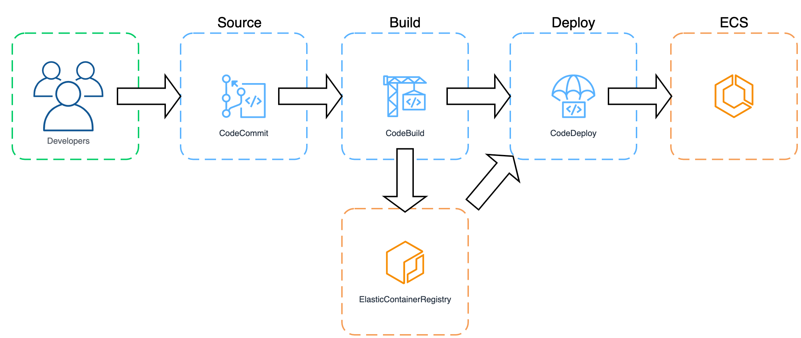
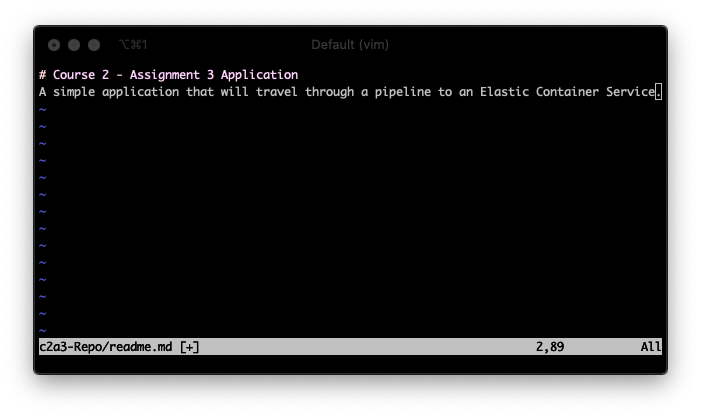
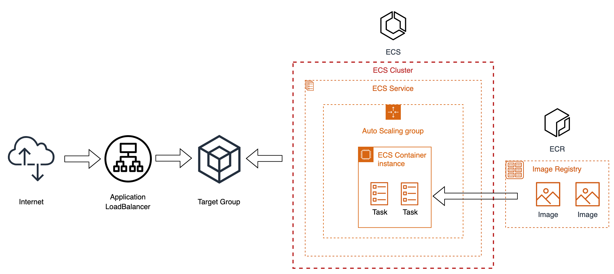
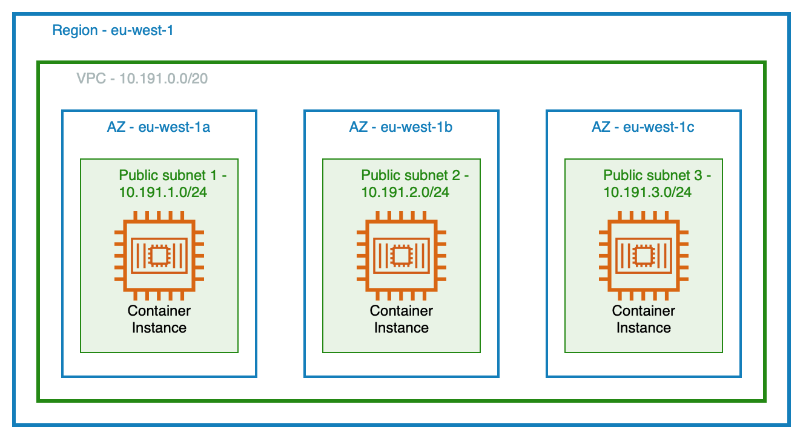
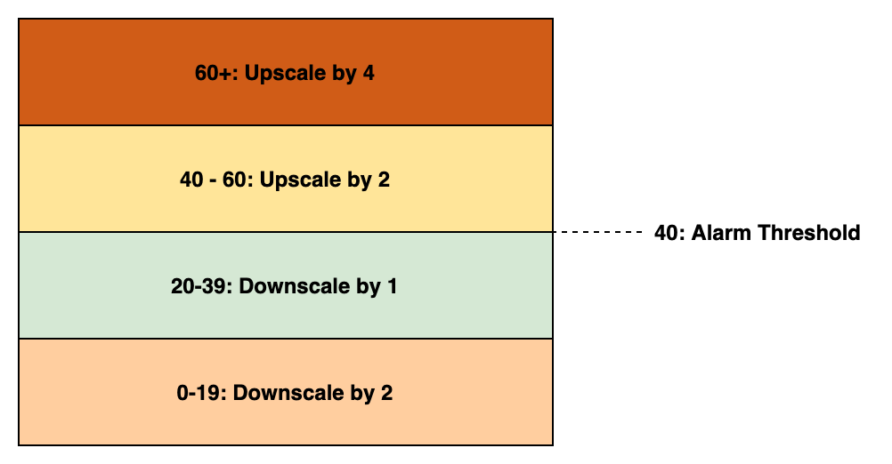
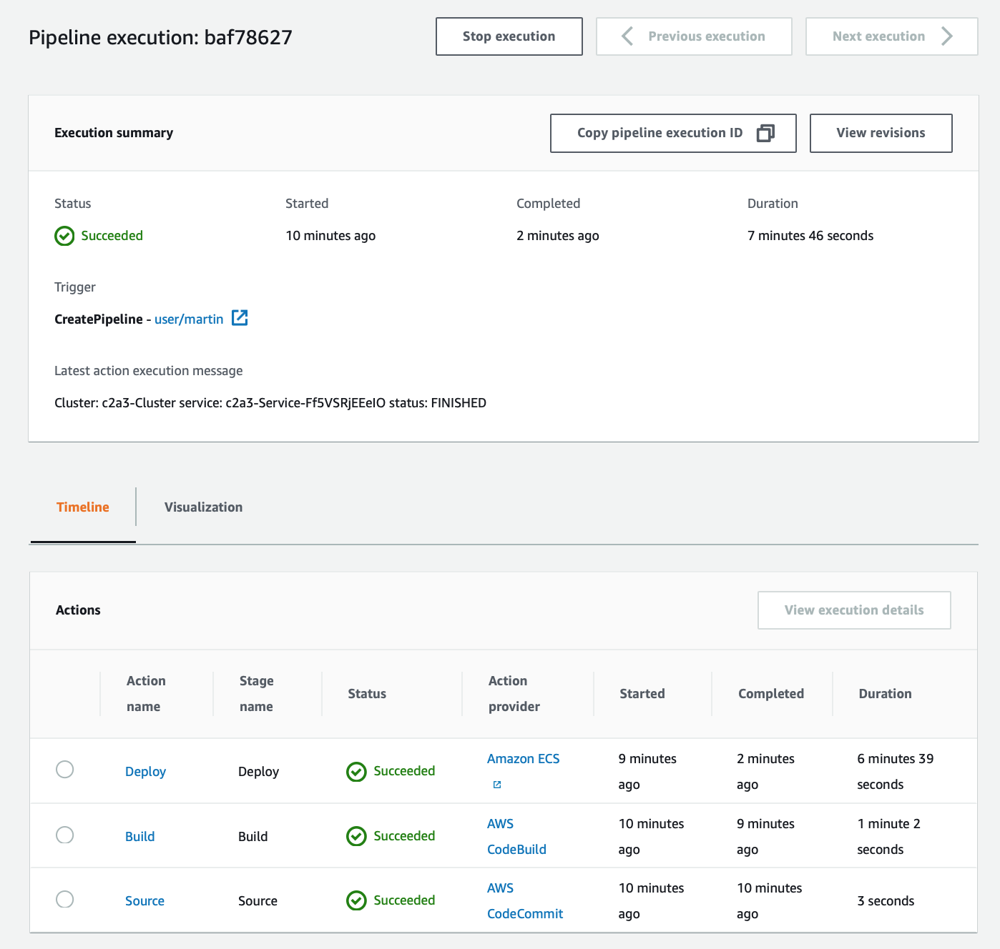
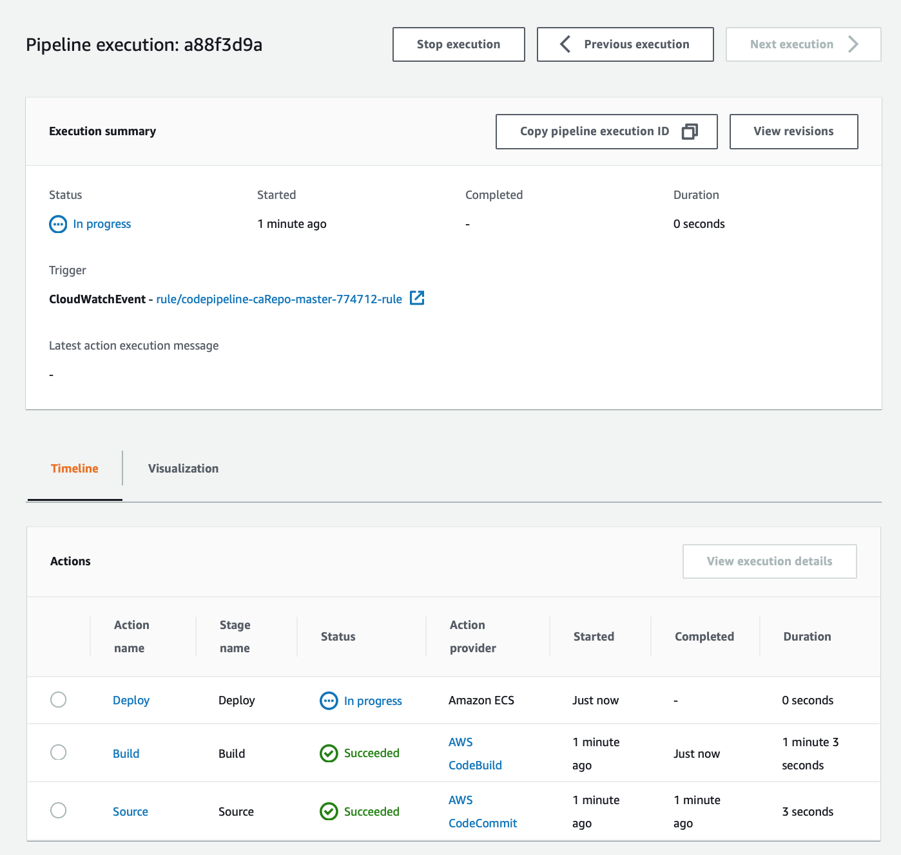
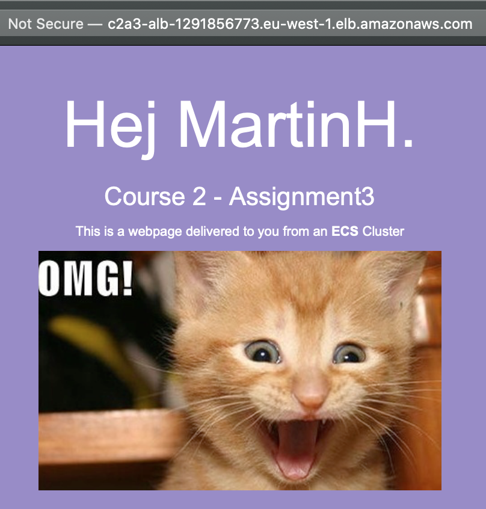

</br>
</br>
</br>
</br>
</br>
</br>
</br>
</br>
</br>
</br>
</br>


<p style="page-break-before: always">

## Innehållsförteckning

<p>
</br>
</br>
</br>
</p>

- [Inledning](#inledning)
  - [Översikt](#%C3%B6versikt)
  - [Förutsättningar](#f%C3%B6ruts%C3%A4ttningar)
- [CodePipeline](#codepipeline)
  - [CodeCommit](#codecommit)
  - [Code](#code)
    - [index.html](#indexhtml)
    - [Dockerfile](#dockerfile)
    - [Buildspec](#buildspec)
  - [Image registry](#image-registry-i-ecr)
- [Build](#build)
  - [IAM Role](#iam-role)
  - [CodeBuild](#codebuild)
  - [Verifiera byggprojekt](#verifera-byggprojekt)
- [S3 bucket](#s3-bucket)
  - [Uppdatera koden för S3](#uppdatera-koden-f%C3%B6r-s3)
    - [Dockerfile](#dockerfile-1)
    - [buildspec.yml](#buildspecyml-1)
    - [index.html](#indexhtml-1)
- [ECS Cluster](#ecs-cluster)
  - [Cloudformation](#cloudformation)
    - [Resources](#resources)
      - [ECS Cluster Overview](#ecs-cluster-overview)
      - [SecurityGroups Overview](#securitygroups-overview)
      - [IAM Roles Overview](#iam-roles-overview)
      - [Network Overview](#network-overview)
      - [LoadBalancer](#loadbalancer)
      - [TargetGroup](#targetgroup)
      - [AutoScalingGroup](#autoscalinggroup)
      - [LaunchConfiguration](#launchconfiguration)
      - [TaskDefinition](#taskdefinition)
      - [Service](#service)
      - [ApplicationAutoScaling](#applicationautoscaling)
      - [CloudWatch Alarm](#cloudwatch-alarm)
    - [Output](#output)
  - [Deploy Cloudformation template](#deploy-cloudformation-template)
  - [Verifiera larm och skalning](#verifiera-larm-och-skalning)
- [CodePipeline](#codepipeline)
  - [Step 1 - Choose pipeline settings](#step-1-choose-pipeline-settings)
  - [Step 2 - Add Source stage](#step-2-add-source-stage)
  - [Step 3 - Add Build stage](#step-3-add-build-stage)
  - [Step 4 - Add Deploy stage](#step-4-add-deploy-stage)
  - [Step 5 - Review](#step-5-review)
    - [Verifiera pipeline - steg 1](#verifiera-pipeline-steg-1)
    - [Verifiera pipeline - steg 2](#verifiera-pipeline-steg-2)
- [Förbättringar](#f%C3%B6rb%C3%A4ttringar)
- [Sammanfattning](#sammanfattning)
- [Appendix A](#appendix-a)
  - [GitHub](#github)
- [Appendix B](#appendix-b)
  - [Cloudformation files](#cloudformation-files)
    - [ecs-c2a3-template.yaml](#ecs-c2a3-templateyaml)
    - [ecs-c2a3-parameters.json](#ecs-c2a3-parametersjson)
- [Appendix C](#appendix-c)
  - [c2a3-Repo files](#c2a3-repo-files)
    - [Dockerfile](#dockerfile)
    - [buildspec.yml](#buildspecyml)
    - [index.html](#indexhtml)
    - [readme.md](#readmemd)

<p style="page-break-before: always">

## Inledning

Uppgiften är att skapa en CI/CD Pipeline medhjälp av CodePipeline. Pipeline:n som skapas skall deploy:a en enkel webbapplikation i en ECS miljö som är uppsatt med hänsyn tagen till säkerhet och skalbarhet. Webbapplikationen består av en docker image som i grunden är en nginx image där vi adderar en egen `index.html` och även en bild som ligger lagrad i en S3 bucket.

### Översikt

En enkel översiktbild över de olika stegen i vår pipeline.



### Förutsättningar

* En lokal aws client.

* AWS konto med tillbörliga rättigheter.

* AWS Region är bestämd till eu-west-1.

* Ett redan skapat keypair i vår AWS Region.

## CI/CD Pipeline

### CodeCommit

Det första steget i att skapa vår pipeline är att skapa upp ett git repository i CodeCommit.

```bash
aws codecommit create-repository --repository-name c2a3-Repo --repository-description "Assignment3 Repository"
```

Output exempel:

```json
{
    "repositoryMetadata": {
        "accountId": "568963037048",
        "repositoryId": "035e3bb4-ade1-4730-8dd9-c52c58ed808a",
        "repositoryName": "c2a3-Repo",
        "repositoryDescription": "Assignment3 Repository",
        "lastModifiedDate": "2020-11-06T13:11:39.432000+01:00",
        "creationDate": "2020-11-06T13:11:39.432000+01:00",
        "cloneUrlHttp": "https://git-codecommit.eu-west-1.amazonaws.com/v1/repos/c2a3-Repo",
        "cloneUrlSsh": "ssh://git-codecommit.eu-west-1.amazonaws.com/v1/repos/c2a3-Repo",
        "Arn": "arn:aws:codecommit:eu-west-1:568963037048:c2a3-Repo"
    }
}
```

Utdatan från `aws cli`kommandot ger oss information angående vilken URL vi skall använda för att klona repot till lokal disk. Så det gör vi.

```bash
git clone https://git-codecommit.eu-west-1.amazonaws.com/v1/repos/c2a3-Repo
Cloning into 'c2a3-Repo'...
warning: You appear to have cloned an empty repository.
```

Precis som kommandot meddelar så har vi klonat ett tomt repository så ett av de första stegen är att lägga dit en första *readme* fil. 

Men allra först lite git konfigurering.

```bash
git config user.name "martin"
git config user.email 70marhel@gafe.molndal.se
git config credential.helper store
```

Nu till vår *readme* fil.

```bash
cd c2a3-Repo
vim readme.md
```



```bash
git add readme.md
git commit -m"Inital commit of a readme file"
git push
```

### Code

Vi kommer att utgå ifrån exempelkod som vi klonar ner .

```bash
cd ..
git clone https://larsappel@bitbucket.org/appelio/pipeline-for-ecs.git
cp pipeline-for-ecs/{Dockerfile,buildspec.yml} ./c2a3-Repo/.
```

#### index.html

Jag skapar även en `index.html` som vi skall använda som vår default index.html i vår nginx container.

```html
<!doctype html>
<html>
  <head>
    <meta charset="utf-8">
    <title>This is the title of the webpage!</title>
    <style>
      body {
        color: #ffffff;
        background-color: #988bc9;
        font-family: Arial, sans-serif;
        font-size:14px;
      }

      h1 {
        font-size: 500%;
        font-weight: normal;
        margin-bottom: 0;
      }
      h2 {
        font-size: 200%;
        font-weight: normal;
        margin-bottom: 0;
      }
    </style>
  </head>
  <body>
    <div align="center">
      <h1>Hej MartinH.</h1>
      <h2>Course 2 - Assignment3</h2>
      <p>This is some text in the <strong>body</strong> of the web-page. <br>
      </p>
      </div>
  </body>
</html>
```

#### Dockerfile

Vi uppdaterar `Dockerfile` på följande vis:

```bash
FROM nginx:latest
LABEL maintainer="Martin H"
COPY ./index.html /usr/share/nginx/html/index.html
```

Dockerfile berättar för oss att vi kommer att använda den senaste nginx imagen ifrån Docker Hub som en grund i vår egen image. Jag sätter en LABEL och sen kopierar jag vår `index.html`till nginx webroot.

#### Buildspec

Jag kopierade ju även in en `buildspec.yml` till vår kod. `buildspec.yml`fungerar som en styrfil till byggsteget, CodeBuild, i vår pipeline.

`buildspec.yml`:

```yaml
version: 0.2

phases:
  install:
    runtime-versions:
      docker: 18
  pre_build:
    commands:
      - echo Login to Amazon ECR...
      - $(aws ecr get-login --region $AWS_DEFAULT_REGION --no-include-email)
      - IMAGE=<registry/name> # change this to your own docker image name
      - COMMIT=$(echo $CODEBUILD_RESOLVED_SOURCE_VERSION | cut -c 1-7)
      - TAG=${COMMIT:=latest}
  build:
    commands:
      - echo Build and tag the docker image...
      - docker build -t $IMAGE:latest .
      - docker tag $IMAGE:latest $IMAGE:$TAG
  post_build:
    commands:
      - echo Push the docker image to Amazon ECR...
      - docker push $IMAGE:latest
      - docker push $IMAGE:$TAG
      - echo Create image definitions file... # use the name as defined in the task definition
      - printf '[{"name":"myimage","imageUri":"%s"}]' $IMAGE:$TAG > imagedefinitions.json
artifacts:
    files: imagedefinitions.json
```

Filen `buildspec.yml`kommer att behöva uppdateras med lite info som beskriver vårt image registry och namnet på vår image. För att få tag på den infon så skapar vi ett image registry i AWS tjänsten ECR.  Men först gör vi commit och pushar vår kod till git repository.

```bash
git add .
git commit -m"Adding more code to git repo"
git push
```

### Image registry i ECR

Nu skapar vi ett image registry ( repository ) i ECR med hjälp av `aws-cli`.

```bash
aws ecr create-repository --repository-name c2a3app --region eu-west-1
```

Exempel output:

```json
{
    "repository": {
        "repositoryArn": "arn:aws:ecr:eu-west-1:568963037048:repository/c2a3app",
        "registryId": "568963037048",
        "repositoryName": "c2a3app",
        "repositoryUri": "568963037048.dkr.ecr.eu-west-1.amazonaws.com/c2a3app",
        "createdAt": "2020-11-06T15:59:57+01:00",
        "imageTagMutability": "MUTABLE",
        "imageScanningConfiguration": {
            "scanOnPush": false
        }
    }
}
```

Vi tar nu datan från parametern `repositoryUri` och lägger in den i vår `buildspec.yml`fil i *pre_build* delen.

```yaml
  <snip>
  pre_build:
    commands:
      - echo Login to Amazon ECR...
      - $(aws ecr get-login --region $AWS_DEFAULT_REGION --no-include-email)
      - IMAGE=568963037048.dkr.ecr.eu-west-1.amazonaws.com/c2a3app
  <snip>
```

Plus att vi måste uppdatera image namnet som skrivs till `imagedefinitions.json` i *post_build* delen.

```yaml
<snip>
  post_build:    
    commands:
<snip>
      - printf '[{"name":"c2a3app","imageUri":"%s"}]' $IMAGE:$TAG > imagedefinitions.json
artifacts:
    files: imagedefinitions.json
```

Nu när det är gjort så pushar vi uppdateringen till git repo:t.

```bash
git add buildspec.yml
git commit -m"Updating file with image registry info and image name"
git push
```

### Build

För att skapa ett CodeBuild projekt med `aws-cli`krävs att vi först skapar en IAM role som vi knyter till vårt byggprojekt. Efter det skapar vi en json-fil innehållande info om projektet och sen skapar vi projektet med hjälp av json-filen.

#### IAM role

Vi skapar upp två stycken filer `create-role.json` och `c2a3app-role-policy.json`.

`create-role.json`

```json
{
  "Version": "2012-10-17",
  "Statement": [
    {
      "Effect": "Allow",
      "Principal": {
        "Service": "codebuild.amazonaws.com"
      },
      "Action": "sts:AssumeRole"
    }
  ]
}
```

`c2a3app-role-policy.json`

```json
{
  "Version": "2012-10-17",
  "Statement": [
    {
      "Sid": "CloudWatchLogsPolicy",
      "Effect": "Allow",
      "Action": [
        "logs:CreateLogGroup",
        "logs:CreateLogStream",
        "logs:PutLogEvents"
      ],
      "Resource": [
          "arn:aws:logs:eu-west-1:568963037048:log-group:/aws/codebuild/c2a3AppBuild",
          "arn:aws:logs:eu-west-1:568963037048:log-group:/aws/codebuild/c2a3AppBuild:*"
      ]
    },
    {
      "Sid": "CodeCommitPolicy",
      "Effect": "Allow",
      "Action": [
        "codecommit:GitPull"
      ],
      "Resource": [
        "arn:aws:codecommit:eu-west-1:568963037048:c2a3-Repo"
      ]
    },
    {
      "Effect": "Allow",
      "Action": [
          "codebuild:CreateReportGroup",
          "codebuild:CreateReport",
          "codebuild:UpdateReport",
          "codebuild:BatchPutTestCases",
          "codebuild:BatchPutCodeCoverages"
      ],
      "Resource": [
        "arn:aws:codebuild:eu-west-1:568963037048:report-group/c2a3AppBuild-*"
      ]
    },
    {
      "Sid": "S3GetObjectPolicy",
      "Effect": "Allow",
      "Action": [
        "s3:GetObject",
        "s3:GetObjectVersion"
      ],
      "Resource": [
        ":aws:s3:::codepipeline-eu-west-1-*"
      ]
    },
    {
      "Sid": "S3PutObjectPolicy",
      "Effect": "Allow",
      "Action": [
        "s3:PutObject"
      ],
      "Resource": [
        ":aws:s3:::codepipeline-eu-west-1-*"
      ]
    },
    {
      "Sid": "S3BucketIdentity",
      "Effect": "Allow",
      "Action": [
        "s3:GetBucketAcl",
        "s3:GetBucketLocation"
      ],
      "Resource": [
        ":aws:s3:::codepipeline-eu-west-1-*"
      ]
    }
  ]
}
```

Policy filen är specifik för min användare, region, git repo och byggprojekt. Vill vi skapa en mer generell policy så skulle vi kunna sätta `"*"` i `Resource` array:n.

Skapa IAM role och policy med följande två kommando:

```bash
aws iam create-role --role-name CodeBuildServiceRole --assume-role-policy-document file://create-role.json
```

```bash
aws iam put-role-policy --role-name CodeBuildServiceRole --policy-name CodeBuildServiceRolePolicy \
--policy-document file://c2a3app-role-policy.json
```

#### CodeBuild

Nu är vi framme vid steget där vi skapar en json-fil som innehåller parametrar för att skapa upp vårt byggprojekt.

```bash
aws codebuild create-project --generate-cli-skeleton > c2a3-codebuild-project.json
```

Editera `c2a3-codebuild-project.json` så att resultatet blir:

```json
{
    "name": "c2a3AppBuild",
    "description": "",
    "source": {
        "type": "CODECOMMIT",
        "location": "https://git-codecommit.eu-west-1.amazonaws.com/v1/repos/c2a3-Repo",
        "gitCloneDepth": 0,
        "gitSubmodulesConfig": {
            "fetchSubmodules": true
        },
        "buildspec": "buildspec.yml",
        "insecureSsl": true
    },
    "sourceVersion": "master",
    "artifacts": {
        "type": "NO_ARTIFACTS"
    },
    "cache": {
        "type": "NO_CACHE",
        "location": "",
        "modes": [
            "LOCAL_DOCKER_LAYER_CACHE"
        ]
    },
    "environment": {
        "type": "LINUX_CONTAINER",
        "image": "aws/codebuild/standard:4.0",
        "computeType": "BUILD_GENERAL1_SMALL",
        "privilegedMode": true,
        "imagePullCredentialsType": "CODEBUILD"
    },
    "serviceRole": "arn:aws:iam::568963037048:role/CodeBuildServiceRole",
    "timeoutInMinutes": 60,
    "queuedTimeoutInMinutes": 360,
    "logsConfig": {
        "cloudWatchLogs": {
            "status": "ENABLED"
        }
    }
}
```

Lägg märke till att jag använder samma namn, c2a3AppBuild,  som jag använde i IAM policy filen i `Resource` array:n.

Vi skapar nu byggprojektet från kommandoraden:

```bash
aws codebuild create-project --cli-input-json file://c2a3-codebuild-project.json
```

För att vårt byggprojekt skall få lov att skriva en resultat image till vårt image registry behöver vi addera ytterligare en policy till vår IAM roll, CodeBuildServiceRole.

Policyn heter *AmazonEC2ContainerRegistryPowerUser* och dess ARN är `arn:aws:iam::aws:policy/AmazonEC2ContainerRegistryPowerUser`.

AWS-Cli kommandot blir då:

```bash
aws iam attach-role-policy --policy-arn arn:aws:iam::aws:policy/AmazonEC2ContainerRegistryPowerUser \
--role-name CodeBuildServiceRole
```

### Verifiera byggprojektet

För att verifiera att byggprojektet fungerar så startar vi ett bygge från kommandoraden

```bash
aws codebuild start-build --project-name c2a3AppBuild
```

Exempel output:

```json
{
    "build": {
        "id": "c2a3AppBuild:f4d8c36c-1855-40c9-ac07-1c7b6d286667",
        "arn": "arn:aws:codebuild:eu-west-1:568963037048:build/c2a3AppBuild:f4d8c36c-1855-40c9-ac07-1c7b6d286667",
        "buildNumber": 1,
        "startTime": "2020-11-06T19:49:41.523000+01:00",
        "currentPhase": "QUEUED",
        "buildStatus": "IN_PROGRESS",
        "sourceVersion": "master",
        "projectName": "c2a3AppBuild",
        "phases": [
            {
                "phaseType": "SUBMITTED",
                "phaseStatus": "SUCCEEDED",
<snip>
```

För att se hur jobbet fortskrider kan vi titta på loggarna.  Vi ser bygg id i output:n från `start-build`kommandot. I exemplet ovan:`"id": "c2a3AppBuild:f4d8c36c-1855-40c9-ac07-1c7b6d286667"`. 

Detta id använder vi för att få fram mer info,

```bash
aws codebuild batch-get-builds --ids c2a3AppBuild:f4d8c36c-1855-40c9-ac07-1c7b6d286667
```

Bl.a. hittar vi `groupName`och `deepLink`.

```json
<snip>
"logs": {
    "groupName": "/aws/codebuild/c2a3AppBuild",
    "streamName": "f4d8c36c-1855-40c9-ac07-1c7b6d286667",
    "deepLink": "https://console.aws.amazon.com/cloudwatch/home?region=eu-west-1#logEvent:group=/aws/codebuild/c2a3AppBuild;stream=f4d8c36c-1855-40c9-ac07-1c7b6d286667",
<snip>
```

Det går även att bara söka ut `groupName`med följande kommandorad:

```bash
aws codebuild batch-get-builds --ids c2a3AppBuild:f4d8c36c-1855-40c9-ac07-1c7b6d286667 \
--query "builds[*].logs.groupName"
```

Example output:

```json
[
    "/aws/codebuild/c2a3AppBuild"
]
```

Med `groupName`kan vi tail:a loggen

```bash
aws logs tail --since 1h --follow /aws/codebuild/c2a3AppBuild
```

Vi kan även hitta loggen om vi kopierar `deepLink`och klistrar in länken i en webbläsare. 

Vi fortsätter att verifiera genom att fastställa att en ny image skapats i vårt registry, c2a3app.

```bash
aws ecr describe-images --repository-name c2a3app --output yaml
```

Exempel output:

```yaml
imageDetails:
- imageDigest: sha256:276850b45182dec0733c66b6756d9fde06e327dee17806060b5116b5c160fa05
  imagePushedAt: '2020-11-06T20:14:04+01:00'
  imageSizeInBytes: 53594796
  imageTags:
  - latest
  - 3fa6f25
  registryId: '568963037048'
  repositoryName: c2a3app
```

## S3 bucket

Vi skapar en S3 bucket för att där kunna lagra den bild som är tänkt att placeras i vår webbapplikation image.

```bash
aws s3 mb s3://c2a3-bucket --region eu-west-1
```

Kopiera bildfilen till S3 bucket.

```bash
aws s3 cp omg-lolcat.jpg s3://c2a3-bucket
```

### Uppdatera koden för S3

Nu behöver vi uppdatera filerna `Dockerfile`, `buildspec.yml` och `index.html`så vi använder vår nya S3 bucket och bildfilen.

#### Dockerfile

Vi ställer oss i vårt git repo och börjar med att editera `Dockerfile`så att resultatet blir följande:

```docker
FROM amazon/aws-cli as build
ARG AWS_DEFAULT_REGION
ARG AWS_CONTAINER_CREDENTIALS_RELATIVE_URI
WORKDIR /app
RUN aws s3 cp s3://c2a3-bucket/omg-lolcat.jpg /app/omg-lolcat.jpg

FROM nginx:latest
LABEL maintainer="Martin H"
COPY ./index.html /usr/share/nginx/html/index.html
COPY --from=build /app/omg-lolcat.jpg /usr/share/nginx/html/omg-lolcat.jpg
```

Dockerfilen skapar en multi-stage build där vi i första steget 

`FROM` använder AWS officiella aws-cli image. 

`ARG` instruktionen måste vi sätta för att vi i byggprocessen skall kunna ladda ner filer från vår S3 bucket utan att behöva skicka med våra privata AWS credentials.

`WORKDIR` skapar en katalog där vi kan mellanlagra vår bildfil.

`RUN` instruktionen kör kommandot som kopierar ner filen `omg-lolcat.jpg`till `/app`.

Sen lägger vi även till en extra `COPY`instruktion som kopierar in `omg-locat.jpg` från byggsteget till vår webbapplikations image.

#### buildspec.yml

I `buildspec.yml`ändrar vi i `build`steget så att `docker build`populerar de argument, ARG, som vi satte i `Dockerfile`.

```yaml
<snip>
  build:
    commands:
      - echo Build and tag the docker image...
      - docker build --build-arg AWS_DEFAULT_REGION=$AWS_DEFAULT_REGION --build-arg AWS_CONTAINER_CREDENTIALS_RELATIVE_URI=$AWS_CONTAINER_CREDENTIALS_RELATIVE_URI -t $IMAGE:latest .
<snip>
```

#### index.html

Vi uppdaterar `index.html`med en img tag.

```html

```

Nu återstår att checka in vår kod i c2a3-Repo.

```bash
git add .
git commit -m"Adding code to use file from S3 bucket"
git push
```

<p style="page-break-before: always">

## ECS Cluster

För att skapa ECS klustret använder vi CloudFormation och en template-fil, `ecs-c2a3-template.yaml`och en parameters-fil `ecs-c2a3-parameters.json`. De fullständiga filerna finns med i Appendix B men jag kommer att beskriva de mest intressanta delarna med hänseende på ECS och skapandet av klustret här.



### CloudFormation

#### Resources

##### ECS Cluster Overview

```yaml
  ECSCluster:
    Type: AWS::ECS::Cluster
    Properties:
      ClusterName: c2a3-Cluster
```

Här skapas ECS klustret och dess namn bestäms. Klustret är tomt och kommer att populeras med EC2 instanser senare i template:n.

##### SecurityGroups Overview

Vår Cloudformation template skapar upp en säkerhetsgrupp som styr åtkomsten till klustret. 

```yaml
  EcsSecurityGroup:
    Type: AWS::EC2::SecurityGroup
    Properties:
      GroupDescription: ECS Security Group
      VpcId: !Ref 'VPC'
  EcsSecurityGroupHTTPinbound:
    Type: AWS::EC2::SecurityGroupIngress
    Properties:
      GroupId: !Ref 'EcsSecurityGroup'
      IpProtocol: tcp
      FromPort: '80'
      ToPort: '80'
      CidrIp: 0.0.0.0/0
  EcsSecurityGroupSSHinbound:
    Type: AWS::EC2::SecurityGroupIngress
    Properties:
      GroupId: !Ref 'EcsSecurityGroup'
      IpProtocol: tcp
      FromPort: '22'
      ToPort: '22'
      CidrIp: !Ref SSHLocation
  EcsSecurityGroupALBports:
    Type: AWS::EC2::SecurityGroupIngress
    Properties:
      GroupId: !Ref 'EcsSecurityGroup'
      IpProtocol: tcp
      FromPort: '31000'
      ToPort: '61000'
      SourceSecurityGroupId: !Ref 'EcsSecurityGroup'
```

Ingressreglerna tillåter http trafik in till vårt kluster från hela internet. Vi har även en regel som tillåter ssh från en specifik ip till EC2 instanserna. Sista ingressregeln beskriver trafik som behöver vara tillåten för att vi skall komma åt våra containers.

##### IAM Roles Overview

Vi skapar upp 3 stycken IAM roller för att kontrollera och fördela rättigheter mellan de olika AWS tjänsterna. 

`EscServiceRole`är kopplad till lastbalanseraren och ECS service:n. Den tilldelar rättigheter att bl.a. lägga till och ta bort containers som lastdelaren kan skicka trafik till.

```yaml
  EcsServiceRole:
    Type: AWS::IAM::Role
    Properties:
      AssumeRolePolicyDocument:
        Statement:
        - Effect: Allow
          Principal:
            Service: [ecs.amazonaws.com]
          Action: ['sts:AssumeRole']
      Path: /
      Policies:
      - PolicyName: ecs-service
        PolicyDocument:
          Statement:
          - Effect: Allow
            Action: ['elasticloadbalancing:DeregisterInstancesFromLoadBalancer', 'elasticloadbalancing:DeregisterTargets',
              'elasticloadbalancing:Describe*', 'elasticloadbalancing:RegisterInstancesWithLoadBalancer',
              'elasticloadbalancing:RegisterTargets', 'ec2:Describe*', 'ec2:AuthorizeSecurityGroupIngress']
            Resource: '*'
```

`AutoscalingRole` är den roll som används av vårt ScalingTarget för att styra rättigheterna vid skalning och tillåtelse att hantera CloudWatch alarm.

```yaml
  AutoscalingRole:
    Type: AWS::IAM::Role
    Properties:
      AssumeRolePolicyDocument:
        Statement:
        - Effect: Allow
          Principal:
            Service: [application-autoscaling.amazonaws.com]
          Action: ['sts:AssumeRole']
      Path: /
      Policies:
      - PolicyName: service-autoscaling
        PolicyDocument:
          Statement:
          - Effect: Allow
            Action: ['application-autoscaling:*', 'cloudwatch:DescribeAlarms', 'cloudwatch:PutMetricAlarm',
              'ecs:DescribeServices', 'ecs:UpdateService']
            Resource: '*'
```

`EC2Role` används av EC2 instanserna och kontrollerar rättigheterna för att bl.a komma åt image registry, registera/avregistrera containerns i klustret och hanteringen av loggar.

```yaml
  EC2Role:
    Type: AWS::IAM::Role
    Properties:
      AssumeRolePolicyDocument:
        Statement:
        - Effect: Allow
          Principal:
            Service: [ec2.amazonaws.com]
          Action: ['sts:AssumeRole']
      Path: /
      ManagedPolicyArns:
        - arn:aws:iam::aws:policy/AmazonEC2ContainerRegistryReadOnly
      Policies:
      - PolicyName: ecs-service
        PolicyDocument:
          Statement:
          - Effect: Allow
            Action: ['ecs:CreateCluster', 'ecs:DeregisterContainerInstance', 'ecs:DiscoverPollEndpoint',
              'ecs:Poll', 'ecr:GetAuthorizationToken', 'ecs:RegisterContainerInstance', 'ecs:StartTelemetrySession',
              'ecs:Submit*', 'logs:CreateLogStream', 'logs:PutLogEvents']
            Resource: '*'
```

##### Network Overview

Template:n skapar upp 3 stycken publika subnät i ett VPC. Varje subnät placeras i var sin Availability Zone. 



EC2 instanserna placeras sedan ut jämt över de tre subnäten. Varje EC2 instans kommer sedan att innehålla containers med vår enkla webbapplikation.

##### LoadBalancer

Konfigurationen för lastbalanseraren beskriver att vi kan skicka trafik till de tre subnäten där våra EC2 instanser och containers befinner sig. Vår säkerhetsgrupp `EcsSecurityGroup` pekas ut. `LoadbalancerListener`skapar kopplingen mellan lastbalanseraren och vår TargetGroup. 

Skulle vi vilja använda ett SSL/TLS certifikat för att säkra kommunikationen mellan klient och lastbalanseraren så är det här som det konfigureras.

```yaml
  LoadBalancer:
    Type: AWS::ElasticLoadBalancingV2::LoadBalancer
    Properties:
      Name: c2a3-alb
      Scheme: internet-facing
      LoadBalancerAttributes:
        - Key: idle_timeout.timeout_seconds
          Value: '30'
      Subnets:
        - !Ref PublicSubnet1
        - !Ref PublicSubnet2
        - !Ref PublicSubnet3
      SecurityGroups:
        - !Ref EcsSecurityGroup
      Tags:
        - Key: Name
          Value: c2a3 Load Balancer
  LoadBalancerListener:
    Type: AWS::ElasticLoadBalancingV2::Listener
    DependsOn: EcsServiceRole
    Properties:
      LoadBalancerArn: !Ref LoadBalancer
      Port: 80
      Protocol: HTTP
      DefaultActions:
        - Type: forward
          TargetGroupArn: !Ref TargetGroup
  LoadBalancerListenerRule:
    Type: AWS::ElasticLoadBalancingV2::ListenerRule
    DependsOn: LoadBalancerListener
    Properties:
      Actions:
      - Type: forward
        TargetGroupArn: !Ref 'TargetGroup'
      Conditions:
      - Field: path-pattern
        Values: [/]
      ListenerArn: !Ref 'LoadBalancerListener'
      Priority: 1
```

##### TargetGroup

Lastdelaren förväntar sig att hitta ett antal instanser i TargetGroup för att lastdela mellan dessa. Det är AutoScaling gruppen som kommer att placera instanserna i Target gruppen.

```yaml
  TargetGroup:
    Type: AWS::ElasticLoadBalancingV2::TargetGroup
    DependsOn: LoadBalancer
    Properties:
      Name: c2a3-TargetGroup
      VpcId: !Ref VPC
      Port: 80
      Protocol: HTTP
      HealthCheckIntervalSeconds: 30
      HealthCheckPath: /
      HealthCheckProtocol: HTTP
      HealthCheckTimeoutSeconds: 5
      HealthyThresholdCount: 5
      UnhealthyThresholdCount: 2
      Tags:
        - Key: Name
          Value: c2a3 Target Group
```

Jag har även tagit med en del HealthCheck parametrar. De värden som är satta är default värdena.

##### AutoScalingGroup

```yaml
  c2a3ASG:
    Type: AWS::AutoScaling::AutoScalingGroup
    Properties:
      AutoScalingGroupName: c2a3-ASG
      MinSize: '0'
      MaxSize: !Ref 'MaxSize'
      DesiredCapacity: !Ref 'DesiredCapacity'
      Cooldown: '120'
      LaunchConfigurationName: !Ref 'ContainerInstances'
      TargetGroupARNs:
        - !Ref TargetGroup
      VPCZoneIdentifier:
        - !Ref PublicSubnet1
        - !Ref PublicSubnet2
        - !Ref PublicSubnet3
      Tags:
        - Key: Name
          Value: c2a3 ECS Cluster
          PropagateAtLaunch: 'true'
    CreationPolicy:
      ResourceSignal:
        Timeout: PT15M
    UpdatePolicy:
      AutoScalingReplacingUpdate:
        WillReplace: 'true'
```

AutoScaling gruppen bestämmer antalet instanser som skall vara ingång och på vilka subnät. Vi ser också `CreationPolicy` som är den konfiguration som tar emot signaleringen från EC2 instanserna när dom rapporterar sig som klara. 

`UpdatePolicy`styr vad som skall hända ifall det sker en uppdatering av konfiguration av instanserna via en förändring av LaunchConfiguration. I detta fall kommer EC2 instanserna att skiftas ut genoma att hela AutoScaling gruppen skapas upp på nytt med den nya konfigurationens instanser. Den gamla gruppen lever kvar och är aktiv tills den nya gruppen är helt färdigskapad för att sedan slängas.

##### LaunchConfiguration

Launchconfigurationen används av AutoScaling gruppen för att skapa upp nya EC2 instanser. I UserData körs ett bash skript som ser till att en fil `ecs.config`skapas med variabeln *ECS_CLUSTER*. Denna variabel och fil används av ECS container agent för att agenten skall veta vilket kluster den tillhör.

```yaml
  ContainerInstances:
    Type: AWS::AutoScaling::LaunchConfiguration
    Properties:
      ImageId: !FindInMap [RegionMap, !Ref 'AWS::Region', AMIAmazon]
      SecurityGroups: [!Ref 'EcsSecurityGroup']
      InstanceType: !Ref 'InstanceType'
      IamInstanceProfile: !Ref 'EC2InstanceProfile'
      KeyName: !Ref 'KeyName'
      UserData:
        Fn::Base64: !Sub |
          #!/bin/bash -xe
          echo ECS_CLUSTER=${ECSCluster} >> /etc/ecs/ecs.config
          yum install -y aws-cfn-bootstrap
          /opt/aws/bin/cfn-signal -e $? --stack ${AWS::StackName} --resource c2a3ASG --region ${AWS::Region}
```

Som sista steg i UserData så signalerar skriptet tillbaka till AutoScaling gruppen att instansen är klar och redo att användas.

ImageId letar upp den AMI som specats tidigare i template:n under *Mappings*. Dessa ami:er är ECS optimerade och hittas på enklaste vis genom att använda `aws-cli`.

```bash
aws ssm get-parameters --names /aws/service/ecs/optimized-ami/amazon-linux-2/recommended --region eu-west-1 --output json
```

eller hitta infon på [Amazon ECS-optimized AMIs - Amazon Elastic Container Service](https://docs.aws.amazon.com/AmazonECS/latest/developerguide/ecs-optimized_AMI.html#ecs-optimized-ami-linux).

##### TaskDefinition

I TaskDefinition beskrivs vår container med tillhörande port mappning och loggning. Vi kan se att vi plockar container image:n ifrån vårt image registry som vi skapade tidigare . 

```yaml
  TaskDefinition:
    Type: AWS::ECS::TaskDefinition
    Properties:
      Family: !Join ['', [!Ref 'AWS::StackName', -c2a3app]]
      ContainerDefinitions:
      - Name: c2a3app
        Image: 568963037048.dkr.ecr.eu-west-1.amazonaws.com/c2a3app:latest
        Cpu: '100'
        Memory: '128'
        LogConfiguration:
          LogDriver: awslogs
          Options:
            awslogs-group: !Ref 'CloudwatchLogsGroup'
            awslogs-region: !Ref 'AWS::Region'
            awslogs-stream-prefix: c2a3app
        PortMappings:
        - ContainerPort: '80'
          HostPort: '0'
```

##### Service

ECS Service använder vår task definition för att plocka rätt container. Här finns även referensen till vår TargetGroup så att containern kan registreras där.

```yaml
  Service:
    Type: AWS::ECS::Service
    DependsOn: LoadBalancerListener
    Properties:
      Cluster: !Ref 'ECSCluster'
      DesiredCount: '3'
      LoadBalancers:
      - ContainerName: c2a3app
        ContainerPort: '80'
        TargetGroupArn: !Ref 'TargetGroup'
      Role: !Ref 'EcsServiceRole'
      TaskDefinition: !Ref 'TaskDefinition'
```

##### ApplicationAutoScaling

Denna del av templaten:n beskriver autoskalningen av applikationen, i vårt fall våra containers. Våra containers skalas horisontellt mellan min och max kapacitet. 

```yaml
  ServiceScalingTarget:
    Type: AWS::ApplicationAutoScaling::ScalableTarget
    DependsOn: Service
    Properties:
      MaxCapacity: 12
      MinCapacity: 1
      ResourceId: !Join ['', [service/, !Ref 'ECSCluster', /, !GetAtt [Service, Name]]]
      RoleARN: !GetAtt [AutoscalingRole, Arn]
      ScalableDimension: ecs:service:DesiredCount
      ServiceNamespace: ecs

  ServiceScalingUpPolicy:
    Type: AWS::ApplicationAutoScaling::ScalingPolicy
    Properties:
      PolicyName: ASteppingPolicyUp
      PolicyType: StepScaling
      ScalingTargetId: !Ref 'ServiceScalingTarget'
      StepScalingPolicyConfiguration:
        AdjustmentType: ChangeInCapacity
        Cooldown: 60
        MetricAggregationType: Average
        StepAdjustments:
        - MetricIntervalLowerBound: 0
          MetricIntervalUpperBound: 20
          ScalingAdjustment: 2
        - MetricIntervalLowerBound: 20
          ScalingAdjustment: 4

  ServiceScalingDownPolicy:
    Type: AWS::ApplicationAutoScaling::ScalingPolicy
    Properties:
      PolicyName: ASteppingPolicyDown
      PolicyType: StepScaling
      ScalingTargetId: !Ref 'ServiceScalingTarget'
      StepScalingPolicyConfiguration:
        AdjustmentType: ChangeInCapacity
        Cooldown: 60
        MetricAggregationType: Average
        StepAdjustments:
        - MetricIntervalUpperBound: -1
          MetricIntervalLowerBound: -20
          ScalingAdjustment: -1
        - MetricIntervalUpperBound: -20
          ScalingAdjustment: -2
```

I `ScalingPolicy` beskrivs även hur skalningen av applikationen skall ske. I vårt fall finns det en policy som skalar upp och en policy som skalar ner. Ett larmvärde hämtas från ett CloudWatch alarm och är summan av antalet http 4XX felkoder under ett tidsintervall. Larmvärdet är satt till 40 stycken felkoder under 1 min. Detta för att jag enkelt skall kunna genomföra ett testa att skalningen fungerar. I verkligheten skulle jag använda ett medelvärde över tid.
För att beskriva de intervall som konfigurerats under `StepAdjustments` krävs en bild.



Två containers kommer att läggas till när antalet felkoder ligger mellan 40 och 60 , men 4 stycken kommer att läggas till om det blir fler än 60 fel. Nedskalningen funkar på liknande sätt genom att en container plockas bort mellan 20-39 och mellan 0-19 är det 2 st. containers som plockas bort.

##### CloudWatch Alarm

Vi har skapat ett alarm som triggas när det rapporteras för många, fler än 10 st.,  HTTP 400 felkoder, se`MetricName`. I `AlarmActions`pekas våra Scaling Policys ut för att trigga en action om att skala upp med dubbelt så många containers.

```yaml
    ALB400sAlarm:
    Type: AWS::CloudWatch::Alarm
    Properties:
      AlarmName: ALB400sAlarm
      AlarmDescription: Alarm if our Application generates too many HTTP 400s.
      Namespace: AWS/ApplicationELB
      MetricName: HTTPCode_Target_4XX_Count
      ComparisonOperator: GreaterThanThreshold
      EvaluationPeriods: '1'
      Statistic: Sum
      Threshold: '40'
      Period: '60'
      AlarmActions:
        - !Ref 'ServiceScalingUpPolicy'
        - !Ref 'ServiceScalingDownPolicy'
      OKActions:
        - !Ref 'ServiceScalingUpPolicy'
        - !Ref 'ServiceScalingDownPolicy'
      Dimensions:
        - Name: LoadBalancer
          Value: !GetAtt
            - LoadBalancer
            - LoadBalancerFullName
```

Detta alarm är kanske inte något som är funktionellt i en produktionsmiljö utan då är ett alarm som larmar på CPUUtilization och MemoryUtilization bättre.

#### Output

I output sektionen plcokar vi fram den URL som vi behöver för att ansluta till vår webbapplikation.

```yaml
Outputs:
  LoadBalancerUrl:
    Description: The URL of the ALB
    Value: !GetAtt LoadBalancer.DNSName
```

### Deploy Cloudformation template

Skapa stacken:

```bash
aws cloudformation create-stack --stack-name c2a3 --template-body file://ecs-c2a3-template.yaml \
--parameters file://ecs-c2a3-parameters.json --capabilities CAPABILITY_NAMED_IAM
```

### Verifiera larm och skalning

För att verifera att alarmet triggar vår scalingPolicy så att antalet containers skalas upp eller ner utför vi ett test.

Vi veriferar att två stycken containers är igång som ett utgångsvärde.

```json
$ aws ecs list-tasks --cluster c2a3-Cluster
{
    "taskArns": [
        "arn:aws:ecs:eu-west-1:568963037048:task/c2a3-Cluster/9f59f7ae077248e897643411d636c32b",
        "arn:aws:ecs:eu-west-1:568963037048:task/c2a3-Cluster/ae1a84a39c544839b76aed930afdd0db"
    ]
}
```

Nu skickar vi 40 eller fler felaktiga curl anrop till vår applikation för att trigga alarmet.

```bash
$ x=1; while [ $x -le 42 ]; do curl -q -s -o /dev/null http://c2a3-alb-884801031.eu-west-1.elb.amazonaws.com/% $(( x++ )); done
```

Då kan vi se att det skapats upp ytterligare 2 stycken containers genom att titta på antalet tasks.

```json
$ aws ecs list-tasks --cluster c2a3-Cluster
{
    "taskArns": [
        "arn:aws:ecs:eu-west-1:568963037048:task/c2a3-Cluster/2972d36f70214338b652a6bab10fbc4d",
        "arn:aws:ecs:eu-west-1:568963037048:task/c2a3-Cluster/9f59f7ae077248e897643411d636c32b",
        "arn:aws:ecs:eu-west-1:568963037048:task/c2a3-Cluster/ad2c20e4ed2648478c1a30432cbe1257",
        "arn:aws:ecs:eu-west-1:568963037048:task/c2a3-Cluster/ae1a84a39c544839b76aed930afdd0db"
    ]
}
```

Nu skickar vi istället 22 felaktiga anrop, 

```bash
x=1; while [ $x -le 22 ]; do curl -q -s -o /dev/null http://c2a3-alb-884801031.eu-west-1.elb.amazonaws.com/% $(( x++ )); done
```

Då skall antalet skalas ner med 1 container efter en cooldown period.

```json
$ aws ecs list-tasks --cluster c2a3-Cluster --profile campus
{
    "taskArns": [
        "arn:aws:ecs:eu-west-1:568963037048:task/c2a3-Cluster/9f59f7ae077248e897643411d636c32b",
        "arn:aws:ecs:eu-west-1:568963037048:task/c2a3-Cluster/ad2c20e4ed2648478c1a30432cbe1257"
        "arn:aws:ecs:eu-west-1:568963037048:task/c2a3-Cluster/ae1a84a39c544839b76aed930afdd0db"
    ]
}
```

Nu skickar vi 5 stycken felaktig anrop, 

```bash
x=1; while [ $x -le 5 ]; do curl -q -s -o /dev/null http://c2a3-alb-884801031.eu-west-1.elb.amazonaws.com/% $(( x++ )); done
```

Då är det tillslut bara en container kvar,

```json
$ aws ecs list-tasks --cluster c2a3-Cluster --profile campus
{
    "taskArns": [
        "arn:aws:ecs:eu-west-1:568963037048:task/c2a3-Cluster/9f59f7ae077248e897643411d636c32b"
    ]
}
```

Ser ut att funka som vi tänkt oss.

## CodePipeline

Efter att vårt ECS kluster är uppe och funktionerande skall vi nu bygga ihop vår Pipeline. Enklaste sättet att genomföra det är att använda oss av *AWS Console:n* -> *Services -> CodeCommit -> Pipeline (CodePipeline) -> Pipelines*. 

Välj knappen *Create pipeline* för att starta den wizard som vi nu skall gå igenom.

##### Step1 - Choose pipeline settings

Sätt ett namn t.ex.`c2a3Pipeline`och välj att fälla ner Advanced settings. Verifera att *Default location* är vald i Artifact store fältet. I övrigt fungerar de förvalda valen. Gå vidare genom att välja *Next*.

##### Step 2 - Add Source stage

I de följande fälten välj, 

Source provider: *AWS CodeCommit*.

Repository name: *c2a3-Repo*

Branch name: *master*

Välj att klicka på *Next*.

##### Step 3 - Add build stage

I steg 3 gör följande val, 

Build provider: *AWS CodeBuild*

Region: *Europe (Irland)*

Project name: *c2a3AppBuild*

Build type: *Single build*

Välj att gå vidare med *Next*.

##### Step 4 - Add deploy stage

I detta steg kommer vi att peka ut vårt ECS kluster som mottagare av vår deploy.

Deploy provider: *Amazon ECS*

Region: *Europe (Ireland)*

Cluster name:  *c2a3-Cluster*

Service name: *c2a3-Service-xxxxx

Image definitions file: Här behöver vi inte fylla i något då vi använde default namnet *imagedefinitions.json* i vår `buildspec.yml`.

Välj att klicka på *Next*.

##### Step 5 - Review

Review steget ger oss en överblick över de val vi gjort i de tidigare stegen.

Välj nu knappen *Create pipeline*.

#### Verifiera pipeline - steg 1

När nu pipeline:n är skapad så kommer den att genomföra en första körning och gå igenom alla stegen *Source*, *Build* och *Deploy*. Om allt går bra kommer stegen att flaggas som Succeded och bli gröna till färgen.



#### Verifiera pipeline - steg 2

För att testa processen helt fullt ut så ändrar vi lite på texten i vår `index.html`, checkar in koden i CodeCommit och detta skall då trigga vår pipeline och i slutänden deploy:a vår nya kod i vårt ECS kluster.

Jag ändrar raden 

```html
<p>This is some text in the <strong>body</strong> of the web-page. <br>
</p>
```

till

```html
 <p>This is a webpage delivered to you from an <strong>ECS</strong> Cluster</p>
```

Checkar in förändring i CodeCommit.

```bash
git add .
git commit -m"Updating text to reflect the truth"
git push
```

Nu verfierar vi att pipeline har startat sin körning.



Ser fint ut. När pipeline:n gått klart veriferar vi även ändringen genom att surfa in på den url som presenteras i CloudFormation stackens output.

```bash
aws cloudformation describe-stacks --stack-name c2a3 --query "Stacks[*].Outputs" --output yaml
- - Description: The URL of the ALB
    OutputKey: LoadBalancerUrl
    OutputValue: c2a3-alb-1291856773.eu-west-1.elb.amazonaws.com
```



Det ser ut att fungera fint.

## Förbättringar

* Placera en bastion instans på ett eget subnät med åtkomst till våra containerinstanser via ssh. Detta är bara relevant om vi fortsätter tillåta ssh access till våra instanser. 

## Sammanfattning

Att använda containers ökar på komplexiteten med ytterligare lager men vinsterna är stora t.ex. snabbheten att plocka upp och ner containers, den snabba vägen mellan utvecklaren och produktionsmiljön, att applikationens miljö i princip är den samma i utvecklarens laptop att utvecklarens lokala miljö i princip ser samma ut som den som är i produktion. 

CI/CD Pipelinen är ett mycket kraftfullt verktyg med fördelar som

* det går snabbare att upptäcka fel 

* produktionssättningar blir automatiserad och behöver inte planeras i veckor innan release. 

* en produktionssättning betyder ingen nertid i miljön. 

* minskade kostnader i och med att många steg automatiseras.

* pålitligheten ökar med ökad automatisering och mindre antal manuella steg.

<p style="page-break-before: always">

## Appendix A

#### GitHub

På GitHub finns de filer som använts i denna uppgift. Även detta dokument återfinns där.
Följ länken: [GitHub - martyV/amazon-aws-kurs/course2/assignment3](https://github.com/martyV/amazon-aws-kurs/tree/master/course2/assignment3)) eller klona repot: `git clone https://github.com/martyV/amazon-aws-kurs.git`.

<p style="page-break-before: always">

## Appendix B

### Cloudformation files

#### ecs-c2a3-template.yaml

```yaml
---
AWSTemplateFormatVersion: "2010-09-09"
Description: "Course 2, Assignment 3 - c2a3"
Metadata:
  AWS::CloudFormation::Interface:
    ParameterGroups:
      - Label:
          default: "Security"
        Parameters:
          - KeyName
          - SSHLocation
      - Label:
          default: "Network"
        Parameters:
          - VpcCidr
          - PublicSubnet1Cidr
          - PublicSubnet2Cidr
          - PublicSubnet3Cidr
      - Label:
          default: "EC2 Instances"
        Parameters:
          - InstanceType
          - DesiredCapacity
          - MaxSize
      - Label:
          default: "ECS containers"
        Parameters:
          - ContainerCapacity
Parameters:
# Network
  VpcCidr:
    Description: VPC for Storage
    Type: String
    Default: 10.191.0.0/20
  PublicSubnet1Cidr:
    Description: Public Subnet 1 for storage
    Type: String
    Default: 10.191.1.0/24
  PublicSubnet2Cidr:
    Description: Public Subnet 2 for storage
    Type: String
    Default: 10.191.2.0/24
  PublicSubnet3Cidr:
    Description: Public Subnet 3 for storage
    Type: String
    Default: 10.191.3.0/24

# Instance
  InstanceType:
    Description: Enter t2.micro, t2.nano or t3.micro. Default is t2.micro.
    Type: String
    Default: t2.micro
    AllowedValues:
      - t2.micro
      - t2.nano
      - t3.micro

# Private ssh key
  KeyName:
    Description: Name of an existing EC2 KeyPair to enable SSH access to the web server
    Type: AWS::EC2::KeyPair::KeyName
    ConstraintDescription: must be the name of an existing EC2 KeyPair.

# SSH Restrication
  SSHLocation:
    Description: The IP address range that can be used to SSH to the EC2 instances
    Type: String
    MinLength: '9'
    MaxLength: '18'
      #Default: 0.0.0.0/0
    Default: 81.230.68.218/32
    AllowedPattern: (\d{1,3})\.(\d{1,3})\.(\d{1,3})\.(\d{1,3})/(\d{1,2})
    ConstraintDescription: must be a valid IP CIDR range of the form x.x.x.x/x.

  DesiredCapacity:
    Type: Number
    Default: '2'
    Description: Number of EC2 instances to launch in your ECS cluster.
  MaxSize:
    Type: Number
    Default: '4'
    Description: Maximum number of EC2 instances that can be launched in your ECS cluster.

  ContainerCapacity:
    Type: Number
    Default: '2'
    Description: The number of containers to launch in your ECS cluster.

Mappings:
  RegionMap:
    eu-west-1:
      AMIAmazon: ami-0c9ef930279337028
    eu-north-1:
      AMIAmazon: ami-03fc956d7468aa8a1
# To find the latest ecs optimized ami run the following commands:
# aws ssm get-parameters --names /aws/service/ecs/optimized-ami/amazon-linux-2/recommended --profile campus --region eu-north-1 --output json
# aws ssm get-parameters --names /aws/service/ecs/optimized-ami/amazon-linux-2/recommended --profile campus --region eu-west-1 --output json
# or get the info at https://docs.aws.amazon.com/AmazonECS/latest/developerguide/ecs-optimized_AMI.html#ecs-optimized-ami-linux

Resources:
  ECSCluster:
    Type: AWS::ECS::Cluster
    Properties:
      ClusterName: c2a3-Cluster

  EcsSecurityGroup:
    Type: AWS::EC2::SecurityGroup
    Properties:
      GroupDescription: ECS Security Group
      VpcId: !Ref 'VPC'
  EcsSecurityGroupHTTPinbound:
    Type: AWS::EC2::SecurityGroupIngress
    Properties:
      GroupId: !Ref 'EcsSecurityGroup'
      IpProtocol: tcp
      FromPort: '80'
      ToPort: '80'
      CidrIp: 0.0.0.0/0
  EcsSecurityGroupSSHinbound:
    Type: AWS::EC2::SecurityGroupIngress
    Properties:
      GroupId: !Ref 'EcsSecurityGroup'
      IpProtocol: tcp
      FromPort: '22'
      ToPort: '22'
      CidrIp: !Ref SSHLocation
  EcsSecurityGroupALBports:
    Type: AWS::EC2::SecurityGroupIngress
    Properties:
      GroupId: !Ref 'EcsSecurityGroup'
      IpProtocol: tcp
      FromPort: '31000'
      ToPort: '61000'
      SourceSecurityGroupId: !Ref 'EcsSecurityGroup'

  CloudwatchLogsGroup:
    Type: AWS::Logs::LogGroup
    Properties:
      LogGroupName: !Join ['-', [EcsLogGroup, !Ref 'AWS::StackName']]
      RetentionInDays: 14

# IAM
  EcsServiceRole:
    Type: AWS::IAM::Role
    Properties:
      AssumeRolePolicyDocument:
        Statement:
        - Effect: Allow
          Principal:
            Service: [ecs.amazonaws.com]
          Action: ['sts:AssumeRole']
      Path: /
      Policies:
      - PolicyName: ecs-service
        PolicyDocument:
          Statement:
          - Effect: Allow
            Action: ['elasticloadbalancing:DeregisterInstancesFromLoadBalancer', 'elasticloadbalancing:DeregisterTargets',
              'elasticloadbalancing:Describe*', 'elasticloadbalancing:RegisterInstancesWithLoadBalancer',
              'elasticloadbalancing:RegisterTargets', 'ec2:Describe*', 'ec2:AuthorizeSecurityGroupIngress']
            Resource: '*'

  AutoscalingRole:
    Type: AWS::IAM::Role
    Properties:
      AssumeRolePolicyDocument:
        Statement:
        - Effect: Allow
          Principal:
            Service: [application-autoscaling.amazonaws.com]
          Action: ['sts:AssumeRole']
      Path: /
      Policies:
      - PolicyName: service-autoscaling
        PolicyDocument:
          Statement:
          - Effect: Allow
            Action: ['application-autoscaling:*', 'cloudwatch:DescribeAlarms', 'cloudwatch:PutMetricAlarm',
              'ecs:DescribeServices', 'ecs:UpdateService']
            Resource: '*'

  EC2Role:
    Type: AWS::IAM::Role
    Properties:
      AssumeRolePolicyDocument:
        Statement:
        - Effect: Allow
          Principal:
            Service: [ec2.amazonaws.com]
          Action: ['sts:AssumeRole']
      Path: /
      ManagedPolicyArns:
        - arn:aws:iam::aws:policy/AmazonEC2ContainerRegistryReadOnly
      Policies:
      - PolicyName: ecs-service
        PolicyDocument:
          Statement:
          - Effect: Allow
            Action: ['ecs:CreateCluster', 'ecs:DeregisterContainerInstance', 'ecs:DiscoverPollEndpoint',
              'ecs:Poll', 'ecr:GetAuthorizationToken', 'ecs:RegisterContainerInstance', 'ecs:StartTelemetrySession',
              'ecs:Submit*', 'logs:CreateLogStream', 'logs:PutLogEvents']
            Resource: '*'

# Network
  VPC:
    Type: AWS::EC2::VPC
    Properties:
      CidrBlock: !Ref VpcCidr
      EnableDnsSupport: true
      EnableDnsHostnames: true
      Tags:
        - Key: Name
          Value: c2a3 Vpc

  InternetGateway:
    Type: AWS::EC2::InternetGateway
    Properties:
      Tags:
        - Key: Name
          Value: c2a3 Internet Gateway

  InternetGatewayAttachment:
    Type: AWS::EC2::VPCGatewayAttachment
    DependsOn:
      - InternetGateway
      - VPC
    Properties:
      InternetGatewayId: !Ref InternetGateway
      VpcId: !Ref VPC

  PublicSubnet1:
    Type: AWS::EC2::Subnet
    DependsOn: VPC
    Properties:
      VpcId: !Ref VPC
      MapPublicIpOnLaunch: true
      CidrBlock: !Ref PublicSubnet1Cidr
      AvailabilityZone: !Select
        - 0
        - !GetAZs
          Ref: AWS::Region
      Tags:
        - Key: Name
          Value: c2a3 Public Subnet AZ1

  PublicSubnet2:
    Type: AWS::EC2::Subnet
    DependsOn: VPC
    Properties:
      VpcId: !Ref VPC
      MapPublicIpOnLaunch: true
      CidrBlock: !Ref PublicSubnet2Cidr
      AvailabilityZone: !Select
        - 1
        - !GetAZs
          Ref: AWS::Region
      Tags:
        - Key: Name
          Value: c2a3 Public Subnet AZ2

  PublicSubnet3:
    Type: AWS::EC2::Subnet
    DependsOn: VPC
    Properties:
      VpcId: !Ref VPC
      MapPublicIpOnLaunch: true
      CidrBlock: !Ref PublicSubnet3Cidr
      AvailabilityZone: !Select
        - 2
        - !GetAZs
          Ref: AWS::Region
      Tags:
        - Key: Name
          Value: c2a3 Public Subnet AZ3

  PublicRouteTable:
    Type: AWS::EC2::RouteTable
    DependsOn: VPC
    Properties:
      VpcId: !Ref VPC
      Tags:
        - Key: Name
          Value: c2a3 Public Route Table

  DefaultPublicRoute:
    Type: AWS::EC2::Route
    DependsOn:
      - PublicRouteTable
      - InternetGatewayAttachment
    Properties:
      DestinationCidrBlock: 0.0.0.0/0
      GatewayId: !Ref InternetGateway
      RouteTableId: !Ref PublicRouteTable

  PublicSubnet1RouteTableAssociation:
    Type: AWS::EC2::SubnetRouteTableAssociation
    DependsOn:
      - PublicRouteTable
      - PublicSubnet1
    Properties:
      RouteTableId: !Ref PublicRouteTable
      SubnetId: !Ref PublicSubnet1

  PublicSubnet2RouteTableAssociation:
    Type: AWS::EC2::SubnetRouteTableAssociation
    DependsOn:
      - PublicRouteTable
      - PublicSubnet2
    Properties:
      RouteTableId: !Ref PublicRouteTable
      SubnetId: !Ref PublicSubnet2

  PublicSubnet3RouteTableAssociation:
    Type: AWS::EC2::SubnetRouteTableAssociation
    DependsOn:
      - PublicRouteTable
      - PublicSubnet3
    Properties:
      RouteTableId: !Ref PublicRouteTable
      SubnetId: !Ref PublicSubnet3

  LoadBalancer:
    Type: AWS::ElasticLoadBalancingV2::LoadBalancer
    Properties:
      Name: c2a3-alb
      Scheme: internet-facing
      LoadBalancerAttributes:
        - Key: idle_timeout.timeout_seconds
          Value: '30'
      Subnets:
        - !Ref PublicSubnet1
        - !Ref PublicSubnet2
        - !Ref PublicSubnet3
      SecurityGroups:
        - !Ref EcsSecurityGroup
      Tags:
        - Key: Name
          Value: c2a3 Load Balancer

  LoadBalancerListener:
    Type: AWS::ElasticLoadBalancingV2::Listener
    DependsOn: EcsServiceRole
    Properties:
      LoadBalancerArn: !Ref LoadBalancer
      Port: 80
      Protocol: HTTP
      DefaultActions:
        - Type: forward
          TargetGroupArn: !Ref TargetGroup
  LoadBalancerListenerRule:
    Type: AWS::ElasticLoadBalancingV2::ListenerRule
    DependsOn: LoadBalancerListener
    Properties:
      Actions:
      - Type: forward
        TargetGroupArn: !Ref 'TargetGroup'
      Conditions:
      - Field: path-pattern
        Values: [/]
      ListenerArn: !Ref 'LoadBalancerListener'
      Priority: 1

  TargetGroup:
    Type: AWS::ElasticLoadBalancingV2::TargetGroup
    DependsOn: LoadBalancer
    Properties:
      Name: c2a3-TargetGroup
      VpcId: !Ref VPC
      Port: 80
      Protocol: HTTP
      HealthCheckIntervalSeconds: 30
      HealthCheckPath: /
      HealthCheckProtocol: HTTP
      HealthCheckTimeoutSeconds: 5
      HealthyThresholdCount: 5
      UnhealthyThresholdCount: 2
      Tags:
        - Key: Name
          Value: c2a3 Target Group

  c2a3ASG:
    Type: AWS::AutoScaling::AutoScalingGroup
    Properties:
      AutoScalingGroupName: c2a3-ASG
      MinSize: '0'
      MaxSize: !Ref 'MaxSize'
      DesiredCapacity: !Ref 'DesiredCapacity'
      Cooldown: '120'
      LaunchConfigurationName: !Ref 'ContainerInstances'
      TargetGroupARNs:
        - !Ref TargetGroup
      VPCZoneIdentifier:
        - !Ref PublicSubnet1
        - !Ref PublicSubnet2
        - !Ref PublicSubnet3
      Tags:
        - Key: Name
          Value: c2a3 ECS Cluster
          PropagateAtLaunch: 'true'
    CreationPolicy:
      ResourceSignal:
        Timeout: PT15M
    UpdatePolicy:
      AutoScalingReplacingUpdate:
        WillReplace: 'true'

  ContainerInstances:
    Type: AWS::AutoScaling::LaunchConfiguration
    Properties:
      ImageId: !FindInMap [RegionMap, !Ref 'AWS::Region', AMIAmazon]
      SecurityGroups: [!Ref 'EcsSecurityGroup']
      InstanceType: !Ref 'InstanceType'
      IamInstanceProfile: !Ref 'EC2InstanceProfile'
      KeyName: !Ref 'KeyName'
      UserData:
        Fn::Base64: !Sub |
          #!/bin/bash -xe
          echo ECS_CLUSTER=${ECSCluster} >> /etc/ecs/ecs.config
          yum install -y aws-cfn-bootstrap
          /opt/aws/bin/cfn-signal -e $? --stack ${AWS::StackName} --resource c2a3ASG --region ${AWS::Region}

  EC2InstanceProfile:
    Type: AWS::IAM::InstanceProfile
    Properties:
      Path: /
      Roles: [!Ref 'EC2Role']

  TaskDefinition:
    Type: AWS::ECS::TaskDefinition
    Properties:
      Family: !Join ['', [!Ref 'AWS::StackName', -c2a3app]]
      ContainerDefinitions:
      - Name: c2a3app
        Image: 568963037048.dkr.ecr.eu-west-1.amazonaws.com/c2a3app:latest
        Cpu: '100'
        Memory: '128'
        LogConfiguration:
          LogDriver: awslogs
          Options:
            awslogs-group: !Ref 'CloudwatchLogsGroup'
            awslogs-region: !Ref 'AWS::Region'
            awslogs-stream-prefix: c2a3app
        PortMappings:
        - ContainerPort: '80'
          HostPort: '0'

  Service:
    Type: AWS::ECS::Service
    DependsOn: LoadBalancerListener
    Properties:
      Cluster: !Ref 'ECSCluster'
      DesiredCount: !Ref 'ContainerCapacity'
      LoadBalancers:
      - ContainerName: c2a3app
        ContainerPort: '80'
        TargetGroupArn: !Ref 'TargetGroup'
      Role: !Ref 'EcsServiceRole'
      TaskDefinition: !Ref 'TaskDefinition'

  ServiceScalingTarget:
    Type: AWS::ApplicationAutoScaling::ScalableTarget
    DependsOn: Service
    Properties:
      MaxCapacity: 12
      MinCapacity: 1
      ResourceId: !Join ['', [service/, !Ref 'ECSCluster', /, !GetAtt [Service, Name]]]
      RoleARN: !GetAtt [AutoscalingRole, Arn]
      ScalableDimension: ecs:service:DesiredCount
      ServiceNamespace: ecs

  ServiceScalingUpPolicy:
    Type: AWS::ApplicationAutoScaling::ScalingPolicy
    Properties:
      PolicyName: ASteppingPolicyUp
      PolicyType: StepScaling
      ScalingTargetId: !Ref 'ServiceScalingTarget'
      StepScalingPolicyConfiguration:
        AdjustmentType: ChangeInCapacity
        Cooldown: 60
        MetricAggregationType: Average
        StepAdjustments:
        - MetricIntervalLowerBound: 0
          MetricIntervalUpperBound: 20
          ScalingAdjustment: 2
        - MetricIntervalLowerBound: 20
          ScalingAdjustment: 4

  ServiceScalingDownPolicy:
    Type: AWS::ApplicationAutoScaling::ScalingPolicy
    Properties:
      PolicyName: ASteppingPolicyDown
      PolicyType: StepScaling
      ScalingTargetId: !Ref 'ServiceScalingTarget'
      StepScalingPolicyConfiguration:
        AdjustmentType: ChangeInCapacity
        Cooldown: 60
        MetricAggregationType: Average
        StepAdjustments:
        - MetricIntervalUpperBound: -1
          MetricIntervalLowerBound: -20
          ScalingAdjustment: -1
        - MetricIntervalUpperBound: -20
          ScalingAdjustment: -2

  ALB400sAlarm:
    Type: AWS::CloudWatch::Alarm
    Properties:
      AlarmName: ALB400sAlarm
      AlarmDescription: Alarm if our Application generates too many HTTP 400s.
      Namespace: AWS/ApplicationELB
      MetricName: HTTPCode_Target_4XX_Count
      ComparisonOperator: GreaterThanThreshold
      EvaluationPeriods: '1'
      Statistic: Sum
      Threshold: '40'
      Period: '60'
      AlarmActions:
        - !Ref 'ServiceScalingUpPolicy'
        - !Ref 'ServiceScalingDownPolicy'
      OKActions:
        - !Ref 'ServiceScalingUpPolicy'
        - !Ref 'ServiceScalingDownPolicy'
      Dimensions:
        - Name: LoadBalancer
          Value: !GetAtt
            - LoadBalancer
            - LoadBalancerFullName

Outputs:
  LoadBalancerUrl:
    Description: The URL of the ALB
    Value: !GetAtt LoadBalancer.DNSName
```

<p style="page-break-before: always">

#### ecs-c2a3-parameters.json

```json
[
  {
    "ParameterKey": "InstanceType",
    "ParameterValue": "t2.micro"
  },
  {
    "ParameterKey": "KeyName",
    "ParameterValue": "martins-aws-campusmolndal"
  },
  {
    "ParameterKey": "SSHLocation",
    "ParameterValue": "81.230.68.218/32"
  },
  {
    "ParameterKey": "DesiredCapacity",
    "ParameterValue": "2"
  },
  {
    "ParameterKey": "ContainerCapacity",
    "ParameterValue": "2"
  }
]
```

<p style="page-break-before: always">

## Appendix C

### c2a3-Repo files

#### Dockerfile

```docker
FROM amazon/aws-cli as build
ARG AWS_DEFAULT_REGION
ARG AWS_CONTAINER_CREDENTIALS_RELATIVE_URI
WORKDIR /app
RUN aws s3 cp s3://c2a3-bucket/omg-lolcat.jpg /app/omg-lolcat.jpg

FROM nginx:latest
LABEL maintainer="Martin H"
COPY ./index.html /usr/share/nginx/html/index.html
COPY --from=build /app/omg-lolcat.jpg /usr/share/nginx/html/omg-lolcat.jpg
```

#### buildspec.yml

```yaml
version: 0.2

phases:
  install:
    runtime-versions:
      docker: 19
  pre_build:
    commands:
      - echo Login to Amazon ECR...
      - $(aws ecr get-login --region $AWS_DEFAULT_REGION --no-include-email)
      - IMAGE=568963037048.dkr.ecr.eu-west-1.amazonaws.com/c2a3app
      - COMMIT=$(echo $CODEBUILD_RESOLVED_SOURCE_VERSION | cut -c 1-7)
      - TAG=${COMMIT:=latest}
  build:
    commands:
      - echo Build and tag the docker image...
      - docker build --build-arg AWS_DEFAULT_REGION=$AWS_DEFAULT_REGION --build-arg AWS_CONTAINER_CREDENTIALS_RELATIVE_URI=$AWS_CONTAINER_CREDENTIALS_RELATIVE_URI -t $IMAGE:latest .
      - docker tag $IMAGE:latest $IMAGE:$TAG
  post_build:
    commands:
      - echo Push the docker image to Amazon ECR...
      - docker push $IMAGE:latest
      - docker push $IMAGE:$TAG
      - echo Create image definitions file...
      - printf '[{"name":"c2a3app","imageUri":"%s"}]' $IMAGE:$TAG > imagedefinitions.json
artifacts:
    files: imagedefinitions.json
```

#### index.html

```html
<!doctype html>
<html>
  <head>
    <meta charset="utf-8">
    <title>This is the title of the webpage!</title>
    <style>
      body {
        color: #ffffff;
        background-color: #988bc9;
        font-family: Arial, sans-serif;
        font-size:14px;
      }

      h1 {
        font-size: 500%;
        font-weight: normal;
        margin-bottom: 0;
      }
      h2 {
        font-size: 200%;
        font-weight: normal;
        margin-bottom: 0;
      }
    </style>
  </head>
  <body>
    <div align="center">
      <h1>Hej MartinH.</h1>
      <h2>Course 2 - Assignment3</h2>
      <p>This is a webpage delivered to you from an <strong>ECS</strong> Cluster</p>
      
      </div>
  </body>
</html>
```

#### readme.md

```markdown
# Course 2 - Assignment 3 Application
A simple application that will travel through a pipeline to an Elastic Container Service.
```
